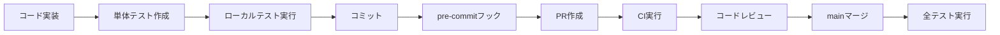

# テスト設計

## 1. テスト戦略

### 1.1 テストピラミッド

本プロジェクトでは、テストピラミッドの原則に基づき、以下の比率でテストを実装します。

``` txt
        /\
       /  \  E2E (10%)
      /____\
     /      \
    / 統合    \ (20%)
   /___________\
  /             \
 /   単体テスト   \ (70%)
/__________________\
```

### 1.2 テストレベル

| レベル                   | 目的                         | ツール                  | 実行タイミング           |
| ------------------------ | ---------------------------- | ----------------------- | ------------------------ |
| ユニットテスト           | 関数・メソッド単位の動作検証 | Vitest, Testing Library | コミット前、PR作成時     |
| 統合テスト               | モジュール間の連携検証       | Vitest, supertest       | PR作成時、mainマージ時   |
| E2Eテスト                | ユーザーシナリオの検証       | Playwright              | mainマージ時、リリース前 |
| セキュリティテスト       | 脆弱性の検出                 | OWASP ZAP, CodeQL       | 週次、リリース前         |
| パフォーマンステスト     | 負荷耐性の検証               | K6                      | リリース前、必要時       |
| アクセシビリティテスト   | WCAG準拠の確認               | axe-core                | PR作成時                 |
| ビジュアルリグレッション | UI変更の検証                 | Storybook, Chromatic    | PR作成時                 |

## 2. テスト種別詳細

### 2.1 ユニットテスト（Unit Test）

#### 対象

- ビジネスロジック
- ユーティリティ関数
- バリデーション
- フック（React Hooks）
- サービス層

#### ツール

- **Vitest** - 高速なテストランナー
- **@testing-library/react** - Reactコンポーネントテスト
- **@testing-library/user-event** - ユーザーインタラクションシミュレーション

#### カバレッジ目標

- 分岐網羅率: 80％以上
- 関数網羅率: 90％以上

#### 命名規則

``` txt
src/
├── components/
│   ├── Button.tsx
│   └── Button.spec.tsx        # コンポーネントテスト
├── hooks/
│   ├── useAuth.ts
│   └── useAuth.spec.ts        # フックテスト
└── utils/
    ├── validation.ts
    └── validation.spec.ts     # ユーティリティテスト
```

### 2.2 統合テスト（Integration Test）

#### 対象

- API エンドポイント
- データベース連携
- 外部サービス連携（モック使用）
- コンポーネント間の連携

#### ツール

- **supertest** - API エンドポイントテスト
- **Vitest** - テストランナー
- **MSW (Mock Service Worker)** - APIモック

#### テストデータ

- Prisma Seed を使用したテストデータ投入
- トランザクションによるテスト後のロールバック

### 2.3 E2Eテスト（End-to-End Test）

#### 対象

- ユーザーシナリオ全体の検証
- クリティカルパス（ログイン、データ登録等）
- ブラウザ互換性

#### ツール

- **Playwright** - E2Eテストフレームワーク
  - Chromium, Firefox, WebKit対応
  - ヘッドレス/ヘッドフルモード

### 2.4 APIテスト

#### 手動テスト

- **REST Client** - VSCode拡張機能
- **Apidog**

#### 負荷テスト

- **K6** - 負荷テストツール

### 2.5 セキュリティテスト

#### SAST (Static Application Security Testing)

**ツール:**

- **CodeQL** - GitHub Code Scanning
- **Biome** - 静的解析

**実行タイミング:**

- PR作成時（自動）
- mainマージ時（自動）

**検出対象:**

- ハードコードされたシークレット
- SQLインジェクション、XSSの可能性
- 安全でないAPI使用

#### DAST (Dynamic Application Security Testing)

**ツール:**

- **OWASP ZAP** - 動的脆弱性スキャナ

**実行タイミング:**

- 週次（ベースラインスキャン）
- リリース前（フルスキャン）
- 重要な機能追加時（フルスキャン）

**対象環境:**

- Staging環境

**レポート:**

- 出力先: `infra/dast/reports/`
- 形式: HTML, JSON, Markdown, XML
- 確認方法:

  ```bash
  open infra/dast/reports/zap-baseline-report-YYYYMMDD-HHMMSS.html
  ```

**脆弱性レベル:**

- **High**: 即座に対応（1営業日以内）
- **Medium**: 次回リリースまでに対応（1週間以内）
- **Low**: 計画的に対応（1ヶ月以内）
- **Informational**: 必要に応じて対応

**詳細:**

- DASTテスト詳細：「infra/dast/README.md」を参照
- [セキュリティ設計](../../05-内部設計/共通仕様/セキュリティ設計.md)

#### 依存パッケージの脆弱性スキャン

- npm audit

### 2.6 アクセシビリティテスト

#### ツール

- **axe-core** - アクセシビリティ検証ツール

#### 準拠基準

- WCAG 2.1 Level AA

### 2.7 ビジュアルリグレッションテスト

#### ツール

- **Storybook** - UIカタログ
- **Chromatic** - ビジュアルテスト

## 3. テストデータ管理

### 3.1 テストデータ投入

- Prisma Seed
- フィクスチャ

### 3.2 テストデータクリーンアップ

- 単体・統合テスト: トランザクションロールバック
- E2Eテスト: 専用テストデータベース使用、テスト後に削除

## 4. モック・スタブ

### 4.1 APIモック（MSW）

### 4.2 依存モジュールのモック

## 5. テスト実行環境

### 5.1 ローカル環境

### 5.2 CI/CD環境

**GitHub Actions:**

- PR作成時: リント、ユニットテスト、統合テスト
- mainマージ時: 全テスト実行
- リリース時: E2Eテスト、DASTテスト

## 6. テスト品質指標

### 6.1 カバレッジ目標

| プロジェクト | 分岐網羅率 | 関数網羅率 | 行網羅率 |
| ------------ | ---------- | ---------- | -------- |
| web          | 70％以上   | 80％以上   | 75％以上 |
| api-core     | 80％以上   | 90％以上   | 85％以上 |
| libs/*       | 80％以上   | 90％以上   | 85％以上 |

### 6.2 成功基準

- 単体・統合テスト: 100％パス
- E2Eテスト: 95％以上パス（環境依存を考慮）
- セキュリティテスト: Highレベルの脆弱性なし
- パフォーマンステスト: レスポンスタイム500ms以内（95パーセンタイル）

## 7. テスト自動化

### 7.1 pre-commit フック

### 7.2 CI/CDパイプライン

**GitHub Actions ワークフロー:**

- `reviewdog.yml` - PRレビュー時のリント
- （今後追加予定）`test.yml` - 自動テスト実行
- （今後追加予定）`dast.yml` - 週次DASTスキャン

## 8. テスト実施タイミング

### 8.1 開発フロー



### 8.2 定期実行

| テスト種別                 | 頻度         | 実行タイミング       |
| -------------------------- | ------------ | -------------------- |
| 単体・統合テスト           | コミットごと | pre-commit, PR作成時 |
| E2Eテスト                  | mainマージ時 | マージ後             |
| DASTテスト（ベースライン） | 週次         | 毎週月曜日           |
| DASTテスト（フル）         | リリース前   | 手動実行             |
| 依存パッケージスキャン     | 週次         | Dependabot           |

## 9. トラブルシューティング

### 9.1 テスト失敗時の対応

1. **ローカルで再現確認**
2. **ログ確認**
   - コンソール出力
   - スクリーンショット（E2Eテスト）
   - ビデオ録画（E2Eテスト）
3. **原因特定**
   - 環境差異の確認
   - データ依存性の確認
   - タイミング問題の確認

### 9.2 よくある問題

#### E2Eテストがタイムアウトする

- タイムアウト時間を延長

#### データベーステストが競合する

- トランザクション分離

## 10. 参考資料

- [Vitest Documentation](https://vitest.dev/)
- [Playwright Documentation](https://playwright.dev/)
- [Testing Library](https://testing-library.com/)
- [OWASP ZAP Documentation](https://www.zaproxy.org/docs/)
- [K6 Documentation](https://k6.io/docs/)
- [axe-core Documentation](https://github.com/dequelabs/axe-core)

## 11. 更新履歴

| 日付       | 版数 | 更新内容           | 更新者      |
| ---------- | ---- | ------------------ | ----------- |
| 2025-11-13 | 1.0  | 初版作成、DAST導入 | Claude Code |
