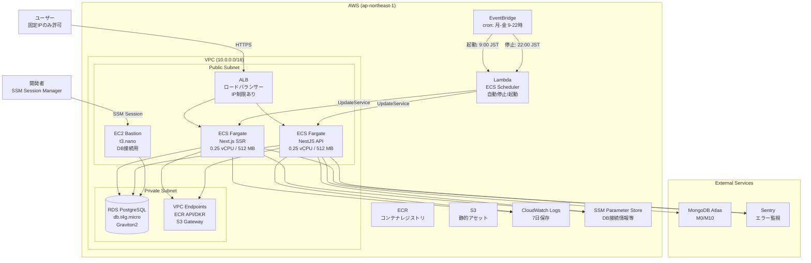
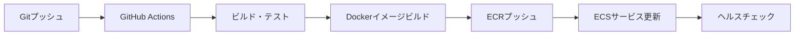

# 検証環境設計（Staging）

## 概要

検証環境は、本番環境に近いAWS構成をコストを抑えて構築し、本番リリース前の最終検証をします。現在のTerraform staging環境に対応します。

## アーキテクチャ図



## サービス構成

### コンピューティング - ECS on Fargate

**構成:**

- **クラスター**: bookmark-manager-staging-cluster
- **タスク定義**:
  - Web: 0.25 vCPU / 512 MB
  - API: 0.25 vCPU / 512 MB

**コスト最適化:**

- NAT Gateway削除（ECSタスクをPublic Subnetに配置）
- VPC Endpoint使用（ECR、S3へのプライベートアクセス）
- 自動停止/起動（営業時間のみ稼働: 月〜金 9:00-22:00）

### データベース - RDS PostgreSQL

**構成:**

- **インスタンスタイプ**: db.t4g.micro（Graviton2）
- **ストレージ**: 20GB（汎用SSD）
- **稼働時間**: 24時間365日

**特徴:**

- Aurora Serverless v2と比較して65％のコスト削減
- 検証環境には十分な性能

### ネットワーク - VPC

**構成:**

- **CIDR**: 10.0.0.0/16
- **Public Subnet**: ECSタスク、ALB、Bastion配置
- **Private Subnet**: RDS PostgreSQL配置
- **NAT Gateway**: 削除（$32/月のコスト削減）

**VPC Endpoint:**

- ECR API（Interface型: $7.2/月）
- ECR DKR（Interface型: $7.2/月）
- S3（Gateway型: 無料）

### 自動停止/起動（ECS Scheduler）

**仕組み:**

- EventBridge + Lambda によるスケジューラー
- 月〜金 9:00-22:00 JST のみ稼働
- 土日・営業時間外は自動停止（desired_count = 0）

**削減効果:**

- ECS稼働時間 65％削減

### モニタリング

**CloudWatch:**

- ログ保存: 7日間
- メトリクス収集: ECS、RDS、ALB

**Sentry（オプション）:**

- エラートラッキング（無料枠: 月間5,000イベント）

**Datadog（オプション）:**

- APM、メトリクス、ログ統合（$25.8/月）

## デプロイフロー

### CI/CD（GitHub Actions）



**主な手順:**

1. feature ブランチへプッシュ → ビルド・テスト
2. main ブランチへマージ → ECRプッシュ
3. ECSサービス自動更新

## セキュリティ

### ネットワークセキュリティ

**Security Group:**

- ALB: 固定IPからのアクセスのみ許可
- ECS: ALBからのアクセスのみ許可
- RDS: ECSとBastionからのアクセスのみ許可

**Bastion EC2:**

- SSM セッション Manager経由でのみアクセス可能
- RDSへのポートフォワーディング用

### シークレット管理

**SSM Parameter Store:**

- DATABASE_URL
- MONGODB_URI
- その他の環境変数

## コスト試算

### 月額コスト（営業時間のみ稼働）

| サービス                      | 月額        |
| ----------------------------- | ----------- |
| RDS PostgreSQL (db.t4g.micro) | $11.5       |
| EC2 Bastion (t3.nano)         | $3.7        |
| ECS Fargate (Web)             | $7.5        |
| ECS Fargate (API)             | $7.5        |
| ALB                           | $17.4       |
| VPC Endpoint (Interface × 2)  | $14.4       |
| Lambda (ECS Scheduler)        | $0.05未満   |
| S3                            | $1-5        |
| CloudWatch Logs               | $5-10       |
| その他                        | $1-5        |
| **合計**                      | **$60〜70** |

### コスト削減施策

| 施策                    | 削減効果                         |
| ----------------------- | -------------------------------- |
| ECS自動停止/起動        | ECS稼働時間 65％削減             |
| Aurora → RDS            | 月額 $28削減（65％削減）         |
| NAT Gateway削除         | 月額 $32削減                     |
| VPC Endpoint使用        | データ転送料 月額$400-500削減    |
| CloudWatch Logs 7日保存 | 月額 $5-10削減                   |
| **合計削減効果**        | **月額 $75-145削減（65％削減）** |

## バックアップ

### RDS PostgreSQL

- 自動バックアップ: 7日間保持
- スナップショット: 手動取得可能

### MongoDB Atlas

- 自動スナップショット（M10以上）
- オンデマンドスナップショット

## 運用

### ログ確認

```bash
# Webサービスのログ
aws logs tail /ecs/bookmark-manager-staging-web --follow

# APIサービスのログ
aws logs tail /ecs/bookmark-manager-staging-api --follow
```

### ECSタスク確認

```bash
aws ecs list-tasks --cluster bookmark-manager-staging-cluster
aws ecs describe-tasks \
  --cluster bookmark-manager-staging-cluster \
  --tasks <task-arn>
```

### データベース接続

```bash
# SSMポートフォワーディング経由
./scripts/connect_to_awsdb.sh staging 5432
```

## 参考リンク

- [AWS ECS Documentation](https://docs.aws.amazon.com/ecs/)
- [RDS PostgreSQL Documentation](https://docs.aws.amazon.com/rds/)
