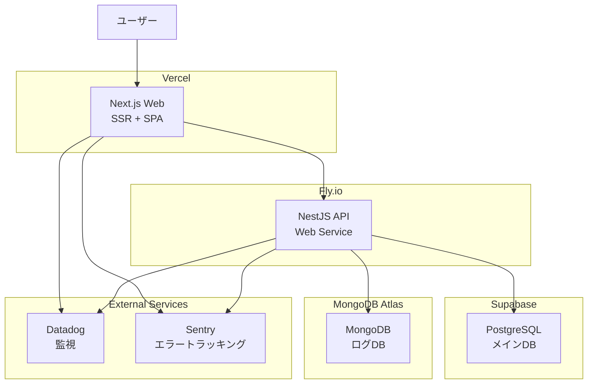
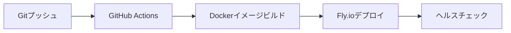

# 本番環境_商用利用前設計（Production - Pre-Commercial）

## 概要

商用利用前は、コスパを重視したマネージドサービスを活用し、実際のユーザーにサービスを提供します。各種利用規約に準拠しつつ、低コストで運用します。

## アーキテクチャ図



## サービス構成

### Web - Vercel

**選定理由:**

- Next.js最適化済みプラットフォーム
- 自動CDN配信
- Git連携による自動デプロイ
- 無料枠で十分な性能

**主要機能:**

- SSR（Server-Side Rendering）
- 静的アセット配信
- プレビューデプロイ
- 環境変数管理
- カスタムドメイン対応

**料金:**

- **Hobby プラン**: $0/月
  - 商用利用不可
  - 100GB 帯域幅
  - Serverless Function実行時間: 100時間/月
- **Pro プラン**: $20/月（商用可）

### API - Fly.io

**選定理由:**

- Node.js/Dockerコンテナ完全対応
- 無料枠で常時稼働可能（スリープなし）
- グローバルエッジネットワーク
- 低レイテンシー（Tokyo リージョン）

**主要機能:**

- Dockerコンテナデプロイ
- 自動スケーリング
- カスタムドメイン対応
- 環境変数管理（Secrets）
- ヘルスチェック
- 自動HTTPS
- リージョン選択（Tokyo）

**料金:**

- **Free プラン**: $0/月
  - $5/月 無料クレジット付与
  - 最大3台の共有CPU-1x、256MBマシン
  - スリープなし（常時稼働）
  - 100GB帯域幅/月
  - IPv6無料（IPv4は$2/月）

### PostgreSQL - Supabase

**選定理由:**

- PostgreSQL完全互換
- 自動バックアップ
- 管理画面（テーブル管理、SQL実行）
- 無料枠で十分な容量

**主要機能:**

- PostgreSQL 17対応
- 自動バックアップ（日次）
- Row Level Security（RLS）
- リアルタイムサブスクリプション
- REST API自動生成（未使用）

**料金:**

- **Free プラン**: $0/月
  - 500MB データベース容量
  - 1GB ファイルストレージ
  - 2GBデータ転送/月
  - 7日間のログ保持
- **Pro プラン**: $25/月
  - 8GB データベース容量
  - 100GB ファイルストレージ
  - 50GB データ転送/月

### MongoDB - MongoDB Atlas

**選定理由:**

- MongoDBマネージドサービス
- 無料枠あり
- クラスター管理が容易
- 本番環境でも同じサービスを使用可能

**主要機能:**

- MongoDB 8.0対応
- 自動バックアップ
- レプリカセット構成
- 監視ダッシュボード

**料金:**

- **M0（Free）プラン**: $0/月
  - 512MB ストレージ
  - 共有RAM
  - 共有vCPU
- **M10 プラン**: $57/月〜
  - 10GB ストレージ
  - 2GB RAM

## モニタリング

### Datadog

- メトリクス収集
- APM（Application Performance Monitoring）
- ログ集約
- アラート設定

**料金:**

- **Free プラン**: $0/月（1ホストまで）
- **Pro プラン**: $15/ホスト/月

### Sentry

- エラートラッキング
- パフォーマンス監視
- アラート通知
- スタックトレース

**料金:**

- **Developer プラン**: $0/月
  - 5,000 イベント/月
  - 1ユーザー
- **Team プラン**: $26/月
  - 50,000 イベント/月

## デプロイフロー

### Web（Vercel）


1. feature ブランチへプッシュ → プレビューデプロイ生成
2. main ブランチへマージ → 自動本番デプロイ
3. 環境変数は Vercel ダッシュボードで管理

### API（Fly.io）



1. main ブランチへプッシュ → GitHub Actions トリガー
2. fly.toml でデプロイ設定管理
3. 環境変数は `flyctl secrets` で管理
4. 自動デプロイまたは手動デプロイ選択可能

## 環境変数管理

### Vercel

```bash
# Vercel CLI
vercel env add <KEY> <VALUE> --environment production

# 主要な環境変数
NEXT_PUBLIC_API_URL=https://api.example.com
SENTRY_DSN=https://...
DATADOG_API_KEY=...
```

### Fly.io

```bash
# Fly.io Secrets（暗号化環境変数）
flyctl secrets set DATABASE_URL="postgresql://..."
flyctl secrets set MONGODB_URI="mongodb+srv://..."
flyctl secrets set DD_API_KEY="..."
flyctl secrets set SENTRY_DSN="..."

# fly.toml（非機密情報）
[env]
  NODE_ENV = "production"
  ENVIRONMENT = "preview"
  PORT = "8080"
```

### Supabase

- Connection String: Supabaseダッシュボードから取得
- 環境変数としてFly.ioへ設定

### MongoDB Atlas

- Connection String: Atlasダッシュボードから取得
- 環境変数としてFly.ioへ設定

## セキュリティ

### 認証・認可

- Supabase Auth（検討中）
- JWT トークン認証

### HTTPS/TLS

- Vercel: 自動HTTPS
- Fly.io: 自動HTTPS
- Supabase: 強制HTTPS
- MongoDB Atlas: TLS 1.2以上

### IPアクセス制限

- MongoDB Atlas: IPホワイトリスト設定
- Supabase: 全IPからアクセス可能（RLS推奨）

### シークレット管理

- 各サービスの環境変数機能を使用
- GitHub Secretsは使用しない（直接サービスへ設定）

## バックアップ

### PostgreSQL（Supabase）

- 自動日次バックアップ
- 7日間保持（Freeプラン）
- Point-in-Time Recovery（Proプラン以上）

### MongoDB（Atlas）

- 自動スナップショット（M10以上）
- オンデマンドスナップショット（手動）

## スケーリング戦略

### Vercel

- 自動スケーリング
- Edge Network による分散配信

### Fly.io

- Free プラン: 垂直スケーリング（手動）
- 水平スケーリング: 複数リージョンへのデプロイ可能
- 自動スケーリング: マシン数の動的調整

### データベース

- Supabase: プラン変更によるスケールアップ
- MongoDB Atlas: クラスター層変更によるスケールアップ

## コスト試算

### 最小構成（開発初期）

| サービス      | プラン    | 月額   |
| ------------- | --------- | ------ |
| Vercel        | Hobby     | $0     |
| Fly.io        | Free      | $0     |
| Supabase      | Free      | $0     |
| MongoDB Atlas | M0        | $0     |
| Datadog       | Free      | $0     |
| Sentry        | Developer | $0     |
| **合計**      |           | **$0** |

### 推奨構成（検証フェーズ）

| サービス      | プラン         | 月額    |
| ------------- | -------------- | ------- |
| Vercel        | Pro            | $20     |
| Fly.io        | Free（十分）   | $0      |
| Supabase      | Free           | $0      |
| MongoDB Atlas | M0             | $0      |
| Datadog       | Pro（1ホスト） | $15     |
| Sentry        | Team           | $26     |
| **合計**      |                | **$61** |

## 制限事項

### Vercel Hobby プラン

- 商用利用不可
- チーム機能なし
- カスタム認証制限

### Fly.io Free プラン

- スリープなし（常時稼働）
- メモリ256MB（共有CPU-1x）
- $5/月の無料クレジット内で運用
- 無料クレジット超過時は従量課金

### Supabase Free プラン

- 500MB容量制限
- 7日間のログ保持
- Point-in-Time Recovery なし

### MongoDB Atlas M0 プラン

- 512MBストレージ制限
- 共有リソース（性能制限）
- バックアップなし

## 商用利用時の注意事項

### Vercel利用規約

**Hobbyプラン（$0/月）:**

- 個人プロジェクト・非商用利用のみ
- **商用利用は利用規約違反**

**商用利用する場合:**

- **Proプラン以上**が必須（$20/月〜）
- 商用利用、チーム機能、カスタム認証が利用可能

### 推奨構成（商用利用時）

初期ユーザー獲得フェーズでは、以下の構成を推奨します。

| サービス      | プラン    | 月額    |
| ------------- | --------- | ------- |
| Vercel        | Pro       | $20     |
| Fly.io        | Free      | $0      |
| Supabase      | Free      | $0      |
| MongoDB Atlas | M0        | $0      |
| Sentry        | Developer | $0      |
| **合計**      |           | **$20** |

## AWS環境への移行

商用利用を本格化する際は、[本番環境_商用利用後設計](04-production-commercial.md) に従ってAWS環境へ移行します。

### 移行タイミング

以下のいずれかに該当する場合、AWS環境への移行を検討します。

- 月間アクティブユーザーが1,000人を超える
- 無料枠を超えて運用コストが$100/月を超える
- 高可用性・スケーラビリティが必要になる
- 独自ドメイン、カスタムSSL証明書が必要

### 移行手順

1. **AWS環境構築**: Terraformによる一括構築
2. **データエクスポート**:
   - Supabase → pg_dump
   - MongoDB Atlas → mongodump
3. **データインポート**:
   - Aurora PostgreSQL ← pg_restore
   - MongoDB Atlas（商用クラスター） ← mongorestore
4. **DNS切り替え**: Route53による段階的なトラフィック移行
5. **検証**: カナリアリリース、A/Bテスト
6. **完全移行**: マネージドサービスの縮小

## 参考リンク

- [Vercel Documentation](https://vercel.com/docs)
- [Fly.io Documentation](https://fly.io/docs/)
- [Supabase Documentation](https://supabase.com/docs)
- [MongoDB Atlas Documentation](https://www.mongodb.com/docs/atlas/)
