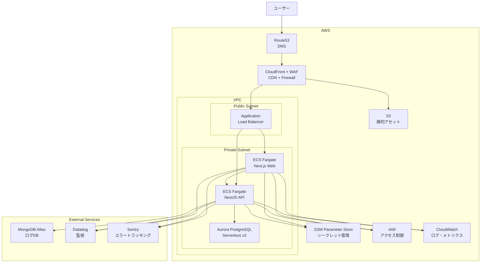
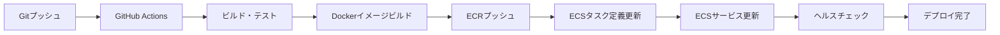

# 本番環境_商用利用後設計（Production - Commercial）

## 概要

商用利用を本格化する際は、AWS上にフルスタックで構築し、高可用性・スケーラビリティ・セキュリティを実現します。Terraform + Terragruntによる完全なIaC管理します。現在のTerraform prod環境に対応します。

## アーキテクチャ図



## インフラ構成

### DNS - Route53

**機能:**

- カスタムドメイン管理
- ヘルスチェック
- トラフィックルーティング
- DNSフェイルオーバー

**設定:**

```hcl
# ホストゾーン
resource "aws_route53_zone" "main" {
  name = "example.com"
}

# Aレコード（CloudFront）
resource "aws_route53_record" "web" {
  zone_id = aws_route53_zone.main.zone_id
  name    = "www.example.com"
  type    = "A"

  alias {
    name                   = aws_cloudfront_distribution.main.domain_name
    zone_id                = aws_cloudfront_distribution.main.hosted_zone_id
    evaluate_target_health = false
  }
}
```

### CDN - CloudFront + WAF

**CloudFront機能:**

- グローバルエッジ配信
- HTTPS/TLS 1.2以上
- カスタムドメイン対応
- キャッシュ制御
- オリジン（ALB、S3）振り分け

**WAF機能:**

- SQLインジェクション防止
- XSS（Cross-Site Scripting）防止
- レートリミット
- 地域ブロック
- IPホワイトリスト/ブラックリスト

**設定:**

```hcl
# WAF Web ACL
resource "aws_wafv2_web_acl" "main" {
  name  = "${var.project_name}-${var.environment}-waf"
  scope = "CLOUDFRONT"

  rule {
    name     = "AWS-AWSManagedRulesCommonRuleSet"
    priority = 1

    override_action {
      none {}
    }

    statement {
      managed_rule_group_statement {
        vendor_name = "AWS"
        name        = "AWSManagedRulesCommonRuleSet"
      }
    }
  }
}
```

### ネットワーク - VPC

**構成:**

- **CIDR**: 10.0.0.0/16（65,536 IPアドレス）
- **Public Subnet**: 10.0.1.0/24、10.0.2.0/24（AZ分散）
- **Private Subnet**: 10.0.11.0/24、10.0.12.0/24（AZ分散）

**リソース:**

- Internet Gateway（IGW）
- NAT Gateway（プライベートサブネットからのアウトバウンド通信）
- VPC Endpoint（S3、ECR、CloudWatch Logsへのプライベート接続）

**設定:**

```hcl
# VPC
resource "aws_vpc" "main" {
  cidr_block           = "10.0.0.0/16"
  enable_dns_hostnames = true
  enable_dns_support   = true
}

# Public Subnet（AZ-a）
resource "aws_subnet" "public_a" {
  vpc_id            = aws_vpc.main.id
  cidr_block        = "10.0.1.0/24"
  availability_zone = "ap-northeast-1a"
}

# Private Subnet（AZ-a）
resource "aws_subnet" "private_a" {
  vpc_id            = aws_vpc.main.id
  cidr_block        = "10.0.11.0/24"
  availability_zone = "ap-northeast-1a"
}

# VPC Endpoint（S3）
resource "aws_vpc_endpoint" "s3" {
  vpc_id            = aws_vpc.main.id
  service_name      = "com.amazonaws.ap-northeast-1.s3"
  vpc_endpoint_type = "Gateway"
  route_table_ids   = [aws_route_table.private.id]
}
```

### ロードバランサー - ALB

**機能:**

- HTTP/HTTPS ターゲットグループ振り分け
- ヘルスチェック
- SSL/TLS終端
- スティッキーセッション
- アクセスログ（S3保存）

**ターゲットグループ:**

- **Web**: /（Next.js SSR）
- **API**: /api/*（NestJS）

**設定:**

```hcl
# Application Load Balancer
resource "aws_lb" "main" {
  name               = "${var.project_name}-${var.environment}-alb"
  internal           = false
  load_balancer_type = "application"
  security_groups    = [var.alb_security_group_id]
  subnets            = var.public_subnet_ids

  enable_deletion_protection = var.enable_deletion_protection
  enable_http2              = true
}

# Target Group（Web）
resource "aws_lb_target_group" "web" {
  name        = "${var.project_name}-${var.environment}-web-tg"
  port        = 3000
  protocol    = "HTTP"
  vpc_id      = var.vpc_id
  target_type = "ip"

  health_check {
    path                = "/api/health"
    healthy_threshold   = 2
    unhealthy_threshold = 3
    timeout             = 5
    interval            = 30
    matcher             = "200"
  }
}

# Listener（HTTP → HTTPS リダイレクト）
resource "aws_lb_listener" "http" {
  load_balancer_arn = aws_lb.main.arn
  port              = "80"
  protocol          = "HTTP"

  default_action {
    type = "redirect"

    redirect {
      port        = "443"
      protocol    = "HTTPS"
      status_code = "HTTP_301"
    }
  }
}
```

### コンピューティング - ECS on Fargate

**構成:**

- **クラスター**: bookmark-manager-production-cluster
- **サービス**:
  - Web: Next.js（SSR）
  - API: NestJS（REST API）

**Fargate タスク定義:**

- **Web**:
  - CPU: 512（0.5 vCPU）
  - Memory: 1024MB
  - ポート: 3000
- **API**:
  - CPU: 512（0.5 vCPU）
  - Memory: 1024MB
  - ポート: 3001

**機能:**

- SSMセッションマネージャー経由のコンテナアクセス
- 自動デプロイ（新イメージプッシュ時）
- ヘルスチェック
- デプロイサーキットブレーカー（自動ロールバック）
- オートスケーリング

**設定:**

```hcl
# ECS Cluster
resource "aws_ecs_cluster" "main" {
  name = "${var.project_name}-${var.environment}-cluster"

  setting {
    name  = "containerInsights"
    value = "enabled"
  }
}

# Task Definition（Web）
resource "aws_ecs_task_definition" "web" {
  family                   = "${var.project_name}-${var.environment}-web"
  network_mode             = "awsvpc"
  requires_compatibilities = ["FARGATE"]
  cpu                      = "512"
  memory                   = "1024"
  execution_role_arn       = var.ecs_execution_role_arn
  task_role_arn            = var.ecs_task_role_arn

  container_definitions = jsonencode([
    {
      name  = "web"
      image = "${var.ecr_repository_url_web}:latest"
      portMappings = [
        {
          containerPort = 3000
          protocol      = "tcp"
        }
      ]
      environment = [
        {
          name  = "NODE_ENV"
          value = "production"
        }
      ]
      secrets = [
        {
          name      = "DATABASE_URL"
          valueFrom = "/${var.project_name}/${var.environment}/DATABASE_URL"
        }
      ]
      logConfiguration = {
        logDriver = "awslogs"
        options = {
          "awslogs-group"         = aws_cloudwatch_log_group.web.name
          "awslogs-region"        = var.aws_region
          "awslogs-stream-prefix" = "ecs"
        }
      }
    }
  ])
}

# ECS Service（Web）
resource "aws_ecs_service" "web" {
  name            = "${var.project_name}-${var.environment}-web"
  cluster         = aws_ecs_cluster.main.id
  task_definition = aws_ecs_task_definition.web.arn
  desired_count   = 2
  launch_type     = "FARGATE"

  enable_execute_command = true
  force_new_deployment   = true

  deployment_circuit_breaker {
    enable   = true
    rollback = true
  }

  network_configuration {
    subnets          = var.private_subnet_ids
    security_groups  = [var.ecs_security_group_id]
    assign_public_ip = false
  }

  load_balancer {
    target_group_arn = aws_lb_target_group.web.arn
    container_name   = "web"
    container_port   = 3000
  }
}
```

### オートスケーリング

**スケーリングポリシー:**

- **CPU使用率ベース**: 70％超過で追加、30％未満で削減
- **スケジュールベース**: 夜間・休日は最小台数に削減

**設定:**

```hcl
# Auto Scaling Target
resource "aws_appautoscaling_target" "api" {
  max_capacity       = 10
  min_capacity       = 2
  resource_id        = "service/${aws_ecs_cluster.main.name}/${aws_ecs_service.api.name}"
  scalable_dimension = "ecs:service:DesiredCount"
  service_namespace  = "ecs"
}

# CPU使用率ベーススケーリング
resource "aws_appautoscaling_policy" "api_cpu" {
  name               = "${var.project_name}-${var.environment}-api-cpu"
  policy_type        = "TargetTrackingScaling"
  resource_id        = aws_appautoscaling_target.api.resource_id
  scalable_dimension = aws_appautoscaling_target.api.scalable_dimension
  service_namespace  = aws_appautoscaling_target.api.service_namespace

  target_tracking_scaling_policy_configuration {
    predefined_metric_specification {
      predefined_metric_type = "ECSServiceAverageCPUUtilization"
    }
    target_value = 70.0
  }
}
```

### データベース - Aurora PostgreSQL Serverless v2

**機能:**

- PostgreSQL 17互換
- 自動スケーリング（0.5 ACU 〜 16 ACU）
- マルチAZ構成
- 自動バックアップ（7日間保持）
- Point-in-Time Recovery
- 暗号化（保管時・転送時）

**構成:**

- **エンジン**: aurora-postgresql
- **エンジンバージョン**: 17.2
- **最小容量**: 0.5 ACU
- **最大容量**: 2 ACU（本番は16 ACU）
- **インスタンス数**: 2（マルチAZ）

**設定:**

```hcl
# Aurora Cluster
resource "aws_rds_cluster" "main" {
  cluster_identifier      = "${var.project_name}-${var.environment}-aurora"
  engine                  = "aurora-postgresql"
  engine_mode             = "provisioned"
  engine_version          = "17.2"
  database_name           = "bookmarkdb"
  master_username         = "dbadmin"
  master_password         = random_password.aurora_password.result
  db_subnet_group_name    = aws_db_subnet_group.aurora.name
  vpc_security_group_ids  = [var.db_security_group_id]
  backup_retention_period = 7
  preferred_backup_window = "03:00-04:00"
  skip_final_snapshot     = false
  deletion_protection     = true

  serverlessv2_scaling_configuration {
    min_capacity = 0.5
    max_capacity = 16
  }
}

# Aurora Cluster Instance
resource "aws_rds_cluster_instance" "main" {
  count = 2

  identifier           = "${var.project_name}-${var.environment}-aurora-${count.index + 1}"
  cluster_identifier   = aws_rds_cluster.main.id
  instance_class       = "db.serverless"
  engine               = aws_rds_cluster.main.engine
  engine_version       = aws_rds_cluster.main.engine_version
  publicly_accessible  = false
  db_subnet_group_name = aws_db_subnet_group.aurora.name
}
```

### NoSQL - MongoDB Atlas

**機能:**

- MongoDB 8.0
- レプリカセット構成
- 自動バックアップ
- 監視ダッシュボード
- ロールベースアクセス制御

**構成:**

- **クラスター層**: M10（本番）
- **リージョン**: AWS ap-northeast-1
- **レプリカセット**: 3ノード
- **ストレージ**: 10GB〜（自動拡張）

**設定:**

```hcl
# MongoDB Atlas Cluster
resource "mongodbatlas_cluster" "main" {
  project_id = var.mongodbatlas_project_id
  name       = "${var.project_name}-${var.environment}"

  provider_name               = "AWS"
  provider_region_name        = "AP_NORTHEAST_1"
  provider_instance_size_name = "M10"

  mongo_db_major_version = "8.0"
  cluster_type           = "REPLICASET"
  replication_factor     = 3

  auto_scaling_disk_gb_enabled = true
}
```

### シークレット管理 - SSM Parameter Store

**管理対象:**

- データベース接続情報（DATABASE_URL）
- MongoDB接続文字列（MONGODB_URI）
- APIキー（Datadog、Sentry）
- JWT署名鍵

**設定:**

```hcl
# Aurora DATABASE_URL
resource "aws_ssm_parameter" "aurora_database_url" {
  name        = "/${var.project_name}/${var.environment}/DATABASE_URL"
  description = "Database connection URL for Prisma"
  type        = "SecureString"
  value       = "postgresql://${var.db_username}:${random_password.aurora_password.result}@${aws_rds_cluster.main.endpoint}:5432/${var.db_name}?schema=public"
}

# MongoDB URI
resource "aws_ssm_parameter" "mongodb_uri" {
  name        = "/${var.project_name}/${var.environment}/MONGODB_URI"
  description = "MongoDB connection string"
  type        = "SecureString"
  value       = var.mongodb_uri
}
```

### 静的アセット - S3

**バケット:**

- **静的ファイル**: images、CSS、JavaScript
- **アクセスログ**: ALBアクセスログ
- **バックアップ**: データベースバックアップ

**設定:**

```hcl
# S3 Bucket（静的アセット）
resource "aws_s3_bucket" "assets" {
  bucket = "${var.project_name}-${var.environment}-assets"

  tags = {
    Name = "${var.project_name}-${var.environment}-assets"
  }
}

# バケット暗号化
resource "aws_s3_bucket_server_side_encryption_configuration" "assets" {
  bucket = aws_s3_bucket.assets.id

  rule {
    apply_server_side_encryption_by_default {
      sse_algorithm = "AES256"
    }
  }
}

# バケットポリシー（CloudFrontからのアクセスのみ許可）
resource "aws_s3_bucket_policy" "assets" {
  bucket = aws_s3_bucket.assets.id

  policy = jsonencode({
    Version = "2012-10-17"
    Statement = [
      {
        Sid    = "AllowCloudFrontAccess"
        Effect = "Allow"
        Principal = {
          Service = "cloudfront.amazonaws.com"
        }
        Action   = "s3:GetObject"
        Resource = "${aws_s3_bucket.assets.arn}/*"
        Condition = {
          StringEquals = {
            "AWS:SourceArn" = aws_cloudfront_distribution.main.arn
          }
        }
      }
    ]
  })
}
```

### モニタリング - CloudWatch

**ログ収集:**

- ECSタスクログ
- ALBアクセスログ
- VPCフローログ

**メトリクス:**

- ECS CPU/メモリ使用率
- ALBリクエスト数/レイテンシ
- Aurora接続数/クエリパフォーマンス

**アラーム:**

- CPU使用率 > 80%
- メモリ使用率 > 80%
- ALB 5xxエラー率 > 5%
- Aurora接続数 > 閾値

**設定:**

```hcl
# CloudWatch Log Group（ECS Web）
resource "aws_cloudwatch_log_group" "web" {
  name              = "/ecs/${var.project_name}-${var.environment}-web"
  retention_in_days = 30
}

# CloudWatch Alarm（CPU使用率）
resource "aws_cloudwatch_metric_alarm" "api_cpu_high" {
  alarm_name          = "${var.project_name}-${var.environment}-api-cpu-high"
  comparison_operator = "GreaterThanThreshold"
  evaluation_periods  = "2"
  metric_name         = "CPUUtilization"
  namespace           = "AWS/ECS"
  period              = "300"
  statistic           = "Average"
  threshold           = "80"
  alarm_description   = "API CPU utilization is too high"
  alarm_actions       = [aws_sns_topic.alerts.arn]

  dimensions = {
    ClusterName = aws_ecs_cluster.main.name
    ServiceName = aws_ecs_service.api.name
  }
}
```

### 外部サービス - Datadog / Sentry

**Datadog:**

- APM（Application Performance Monitoring）
- インフラストラクチャ監視
- ログ管理
- ダッシュボード

**Sentry:**

- エラートラッキング
- パフォーマンス監視
- リリース追跡
- アラート通知

**設定:**

```hcl
# Datadog Monitor
resource "datadog_monitor" "api_error_rate" {
  name    = "${var.project_name}-${var.environment} API Error Rate"
  type    = "metric alert"
  message = "API error rate is too high @slack-alerts"

  query = "avg(last_5m):sum:trace.express.request.errors{env:${var.environment}} / sum:trace.express.request.hits{env:${var.environment}} > 0.05"

  thresholds = {
    critical = 0.05
    warning  = 0.03
  }
}

# Sentry Project
resource "sentry_project" "api" {
  organization = var.sentry_organization
  team         = var.sentry_team
  name         = "${var.project_name}-${var.environment}-api"
  platform     = "node"
}
```

## セキュリティ

### IAMロール・ポリシー

**ECSタスク実行ロール:**

- ECRイメージプル
- CloudWatch Logsへの書き込み
- SSM Parameter Storeからのシークレット取得

**ECSタスクロール:**

- S3バケットへのアクセス
- SSMセッションマネージャー接続

**設定:**

```hcl
# ECS Task Execution Role
resource "aws_iam_role" "ecs_execution_role" {
  name = "${var.project_name}-${var.environment}-ecs-execution-role"

  assume_role_policy = jsonencode({
    Version = "2012-10-17"
    Statement = [
      {
        Action = "sts:AssumeRole"
        Effect = "Allow"
        Principal = {
          Service = "ecs-tasks.amazonaws.com"
        }
      }
    ]
  })
}

# ポリシーアタッチ
resource "aws_iam_role_policy_attachment" "ecs_execution_role_policy" {
  role       = aws_iam_role.ecs_execution_role.name
  policy_arn = "arn:aws:iam::aws:policy/service-role/AmazonECSTaskExecutionRolePolicy"
}

# SSM Parameter Store読み取り権限
resource "aws_iam_role_policy" "ecs_ssm_policy" {
  name = "${var.project_name}-${var.environment}-ecs-ssm-policy"
  role = aws_iam_role.ecs_execution_role.id

  policy = jsonencode({
    Version = "2012-10-17"
    Statement = [
      {
        Action = [
          "ssm:GetParameters",
          "ssm:GetParameter"
        ]
        Effect   = "Allow"
        Resource = "arn:aws:ssm:${var.aws_region}:${data.aws_caller_identity.current.account_id}:parameter/${var.project_name}/${var.environment}/*"
      }
    ]
  })
}
```

### Security Group

**ALB Security Group:**

- インバウンド: 80（HTTP）、443（HTTPS）全許可
- アウトバウンド: ECSセキュリティグループへのみ許可

**ECS Security Group:**

- インバウンド: ALBからの3000、3001ポートのみ許可
- アウトバウンド: Aurora、インターネット（HTTPS）への通信許可

**Aurora Security Group:**

- インバウンド: ECSからの5432ポートのみ許可
- アウトバウンド: なし

**設定:**

```hcl
# ALB Security Group
resource "aws_security_group" "alb" {
  name        = "${var.project_name}-${var.environment}-alb-sg"
  description = "Security group for ALB"
  vpc_id      = var.vpc_id

  ingress {
    from_port   = 80
    to_port     = 80
    protocol    = "tcp"
    cidr_blocks = ["0.0.0.0/0"]
  }

  ingress {
    from_port   = 443
    to_port     = 443
    protocol    = "tcp"
    cidr_blocks = ["0.0.0.0/0"]
  }

  egress {
    from_port       = 3000
    to_port         = 3001
    protocol        = "tcp"
    security_groups = [aws_security_group.ecs.id]
  }
}

# ECS Security Group
resource "aws_security_group" "ecs" {
  name        = "${var.project_name}-${var.environment}-ecs-sg"
  description = "Security group for ECS tasks"
  vpc_id      = var.vpc_id

  ingress {
    from_port       = 3000
    to_port         = 3001
    protocol        = "tcp"
    security_groups = [aws_security_group.alb.id]
  }

  egress {
    from_port   = 0
    to_port     = 0
    protocol    = "-1"
    cidr_blocks = ["0.0.0.0/0"]
  }
}

# Aurora Security Group
resource "aws_security_group" "aurora" {
  name        = "${var.project_name}-${var.environment}-aurora-sg"
  description = "Security group for Aurora PostgreSQL"
  vpc_id      = var.vpc_id

  ingress {
    from_port       = 5432
    to_port         = 5432
    protocol        = "tcp"
    security_groups = [aws_security_group.ecs.id]
  }
}
```

## デプロイフロー

### CI/CDパイプライン（GitHub Actions）



**GitHub Actions ワークフロー:**

```yaml
name: Deploy to Production

on:
  push:
    branches:
      - main

jobs:
  deploy:
    runs-on: ubuntu-latest
    steps:
      - uses: actions/checkout@v4

      - name: Configure AWS credentials
        uses: aws-actions/configure-aws-credentials@v4
        with:
          aws-access-key-id: ${{ secrets.AWS_ACCESS_KEY_ID }}
          aws-secret-access-key: ${{ secrets.AWS_SECRET_ACCESS_KEY }}
          aws-region: ap-northeast-1

      - name: Login to Amazon ECR
        id: login-ecr
        uses: aws-actions/amazon-ecr-login@v2

      - name: Build and push Docker image
        env:
          ECR_REGISTRY: ${{ steps.login-ecr.outputs.registry }}
          ECR_REPOSITORY: bookmark-manager-production-api
          IMAGE_TAG: ${{ github.sha }}
        run: |
          docker build -t $ECR_REGISTRY/$ECR_REPOSITORY:$IMAGE_TAG -f src/apps/web-api/core/Dockerfile .
          docker push $ECR_REGISTRY/$ECR_REPOSITORY:$IMAGE_TAG

      - name: Deploy to ECS
        run: |
          aws ecs update-service \
            --cluster bookmark-manager-production-cluster \
            --service bookmark-manager-production-api \
            --force-new-deployment
```

## コスト試算

### 月額コスト（想定）

| サービス             | 項目                               | 月額     |
| -------------------- | ---------------------------------- | -------- |
| ECS Fargate          | 0.5 vCPU × 1GB × 2タスク × 730時間 | $35      |
| Aurora Serverless v2 | 0.5 ACU × 2インスタンス × 730時間  | $66      |
| ALB                  | 1台 × 730時間 + データ転送         | $25      |
| NAT Gateway          | 1台 × 730時間 + データ転送         | $40      |
| CloudFront           | 1TB転送                            | $85      |
| Route53              | ホストゾーン + クエリ              | $1       |
| S3                   | 100GB ストレージ + リクエスト      | $3       |
| CloudWatch Logs      | 10GB ログ                          | $5       |
| MongoDB Atlas        | M10（10GB）                        | $57      |
| Datadog              | 2ホスト                            | $30      |
| Sentry               | Teamプラン                         | $26      |
| **合計**             |                                    | **$373** |

### コスト削減施策

1. **VPC Endpoint**: NAT Gateway料金削減（$40 → $10）
2. **オートスケーリング**: 夜間・休日のタスク削減（$35 → $25）
3. **CloudWatch Logs保持期間**: 30日 → 7日（$5 → $2）
4. **Aurora Serverless v2**: 最小容量0.5 ACU（$66維持）

**削減後:**

- **合計**: $373 → $320

## 運用

### バックアップ

**Aurora PostgreSQL:**

- 自動バックアップ: 7日間保持
- スナップショット: 手動取得
- Point-in-Time Recovery: 任意時点への復元

**MongoDB Atlas:**

- 自動スナップショット: 日次
- オンデマンドスナップショット: 手動取得

### ディザスタリカバリ

**目標:**

- **RTO（Recovery Time Objective）**: 4時間
- **RPO（Recovery Point Objective）**: 1時間

**手順:**

1. マルチAZ構成によるフェイルオーバー（自動）
2. バックアップからの復元（手動）
3. 別リージョンへの切り替え（将来）

### アップデート

**Fargate プラットフォームバージョン:**

- 自動更新（最新バージョン）

**Aurora PostgreSQL:**

- マイナーバージョン: 自動更新
- メジャーバージョン: 手動更新

**ECSタスク定義:**

- 新イメージプッシュ時に自動更新

## 参考リンク

- [AWS Documentation](https://docs.aws.amazon.com/)
- [Terraform AWS Provider](https://registry.terraform.io/providers/hashicorp/aws/latest/docs)
- [Terragrunt Documentation](https://terragrunt.gruntwork.io/docs/)
