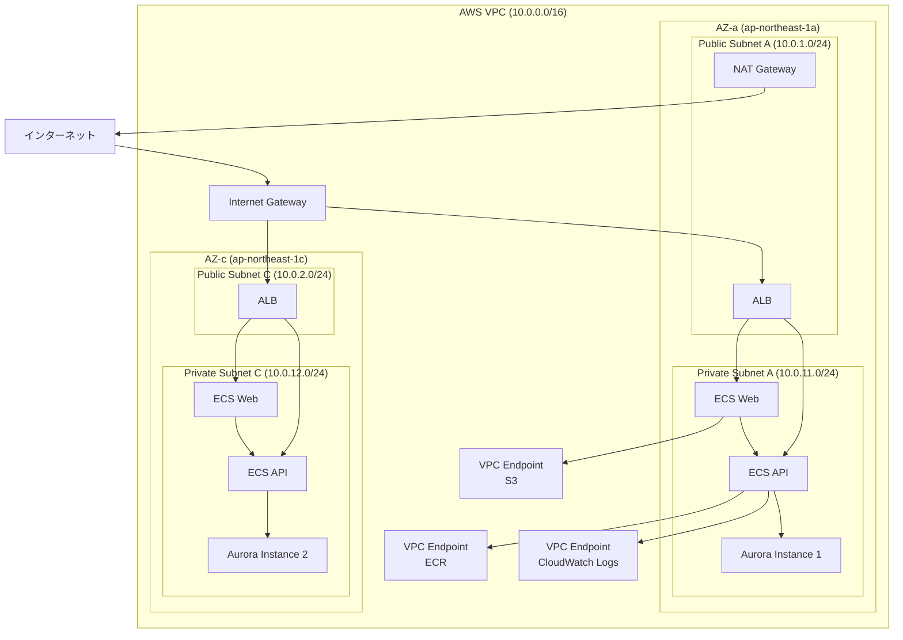

# ネットワーク設計

## 概要

本番環境（AWS）のネットワーク設計について記載します。セキュリティとコスト最適化を考慮した構成です。

## ネットワーク構成図



## VPC設計

### 基本設定

| 項目                   | 値                               |
| ---------------------- | -------------------------------- |
| VPC CIDR               | 10.0.0.0/16                      |
| リージョン             | ap-northeast-1（東京）           |
| アベイラビリティゾーン | ap-northeast-1a、ap-northeast-1c |
| DNS解決                | 有効                             |
| DNSホスト名            | 有効                             |

### CIDR設計

```txt
VPC: 10.0.0.0/16 (65,536 IPアドレス)
├── Public Subnet A (AZ-a): 10.0.1.0/24 (256 IPアドレス)
├── Public Subnet C (AZ-c): 10.0.2.0/24 (256 IPアドレス)
├── Private Subnet A (AZ-a): 10.0.11.0/24 (256 IPアドレス)
├── Private Subnet C (AZ-c): 10.0.12.0/24 (256 IPアドレス)
└── 予約（将来拡張用）: 10.0.3.0/24〜10.0.254.0/24
```

### Terraform設定

```hcl
# VPC
resource "aws_vpc" "main" {
  cidr_block           = "10.0.0.0/16"
  enable_dns_hostnames = true
  enable_dns_support   = true

  tags = {
    Name = "${var.project_name}-${var.environment}-vpc"
  }
}
```

## サブネット設計

### Public Subnet

**用途:**

- Application Load Balancer（ALB）
- NAT Gateway
- 踏み台サーバー（Bastion）※開発時のみ

**特徴:**

- インターネットゲートウェイへのルート
- パブリックIPアドレス自動割り当て

**設定:**

```hcl
# Public Subnet A（AZ-a）
resource "aws_subnet" "public_a" {
  vpc_id                  = aws_vpc.main.id
  cidr_block              = "10.0.1.0/24"
  availability_zone       = "ap-northeast-1a"
  map_public_ip_on_launch = true

  tags = {
    Name = "${var.project_name}-${var.environment}-public-subnet-a"
  }
}

# Public Subnet C（AZ-c）
resource "aws_subnet" "public_c" {
  vpc_id                  = aws_vpc.main.id
  cidr_block              = "10.0.2.0/24"
  availability_zone       = "ap-northeast-1c"
  map_public_ip_on_launch = true

  tags = {
    Name = "${var.project_name}-${var.environment}-public-subnet-c"
  }
}
```

### Private Subnet

**用途:**

- ECSタスク（Web、API）
- Aurora PostgreSQL
- 内部リソース全般

**特徴:**

- インターネットへの直接アクセス不可
- NAT Gateway経由でアウトバウンド通信可能
- VPC Endpoint経由でAWSサービスへのプライベート接続

**設定:**

```hcl
# Private Subnet A（AZ-a）
resource "aws_subnet" "private_a" {
  vpc_id            = aws_vpc.main.id
  cidr_block        = "10.0.11.0/24"
  availability_zone = "ap-northeast-1a"

  tags = {
    Name = "${var.project_name}-${var.environment}-private-subnet-a"
  }
}

# Private Subnet C（AZ-c）
resource "aws_subnet" "private_c" {
  vpc_id            = aws_vpc.main.id
  cidr_block        = "10.0.12.0/24"
  availability_zone = "ap-northeast-1c"

  tags = {
    Name = "${var.project_name}-${var.environment}-private-subnet-c"
  }
}
```

## ルーティング設計

### Public Subnet ルートテーブル

| 送信先      | ターゲット | 説明                       |
| ----------- | ---------- | -------------------------- |
| 10.0.0.0/16 | local      | VPC内通信                  |
| 0.0.0.0/0   | igw-xxx    | インターネットゲートウェイ |

**設定:**

```hcl
# Public Route Table
resource "aws_route_table" "public" {
  vpc_id = aws_vpc.main.id

  route {
    cidr_block = "0.0.0.0/0"
    gateway_id = aws_internet_gateway.main.id
  }

  tags = {
    Name = "${var.project_name}-${var.environment}-public-rt"
  }
}

# Public Subnet Association
resource "aws_route_table_association" "public_a" {
  subnet_id      = aws_subnet.public_a.id
  route_table_id = aws_route_table.public.id
}

resource "aws_route_table_association" "public_c" {
  subnet_id      = aws_subnet.public_c.id
  route_table_id = aws_route_table.public.id
}
```

### Private Subnet ルートテーブル

| 送信先      | ターゲット | 説明        |
| ----------- | ---------- | ----------- |
| 10.0.0.0/16 | local      | VPC内通信   |
| 0.0.0.0/0   | nat-xxx    | NAT Gateway |

**設定:**

```hcl
# Private Route Table
resource "aws_route_table" "private" {
  vpc_id = aws_vpc.main.id

  route {
    cidr_block     = "0.0.0.0/0"
    nat_gateway_id = aws_nat_gateway.main.id
  }

  tags = {
    Name = "${var.project_name}-${var.environment}-private-rt"
  }
}

# Private Subnet Association
resource "aws_route_table_association" "private_a" {
  subnet_id      = aws_subnet.private_a.id
  route_table_id = aws_route_table.private.id
}

resource "aws_route_table_association" "private_c" {
  subnet_id      = aws_subnet.private_c.id
  route_table_id = aws_route_table.private.id
}
```

## Internet Gateway

**用途:**

- VPCとインターネット間の通信を可能にする
- Public Subnetからのアウトバウンド通信
- Public Subnetへのインバウンド通信

**設定:**

```hcl
# Internet Gateway
resource "aws_internet_gateway" "main" {
  vpc_id = aws_vpc.main.id

  tags = {
    Name = "${var.project_name}-${var.environment}-igw"
  }
}
```

## NAT Gateway

**用途:**

- Private Subnetからインターネットへのアウトバウンド通信
- パッケージ更新、外部API呼び出し等

**コスト:**

- $0.059/時間（約$43/月）
- データ処理料金: $0.059/GB

**削減策:**

- VPC Endpointの活用（S3、ECR、CloudWatch Logs）
- staging環境では無効化も検討

**設定:**

```hcl
# Elastic IP for NAT Gateway
resource "aws_eip" "nat" {
  domain = "vpc"

  tags = {
    Name = "${var.project_name}-${var.environment}-nat-eip"
  }

  depends_on = [aws_internet_gateway.main]
}

# NAT Gateway（AZ-a のみ）
resource "aws_nat_gateway" "main" {
  allocation_id = aws_eip.nat.id
  subnet_id     = aws_subnet.public_a.id

  tags = {
    Name = "${var.project_name}-${var.environment}-nat"
  }

  depends_on = [aws_internet_gateway.main]
}
```

## VPC Endpoint

**用途:**

- AWSサービスへのプライベート接続
- NAT Gateway経由のデータ転送料金削減
- セキュリティ向上（インターネット経由不要）

### S3 Gateway Endpoint

**特徴:**

- Gateway型（無料）
- S3へのプライベート接続

**設定:**

```hcl
# VPC Endpoint for S3
resource "aws_vpc_endpoint" "s3" {
  vpc_id            = aws_vpc.main.id
  service_name      = "com.amazonaws.ap-northeast-1.s3"
  vpc_endpoint_type = "Gateway"
  route_table_ids   = [aws_route_table.private.id]

  tags = {
    Name = "${var.project_name}-${var.environment}-s3-endpoint"
  }
}
```

### ECR Interface Endpoint

**特徴:**

- Interface型（有料）
- ECRからのDockerイメージプルを高速化

**コスト:**

- $0.014/時間（約$10/月）
- データ処理料金削減効果 > エンドポイント料金

**設定:**

```hcl
# VPC Endpoint for ECR API
resource "aws_vpc_endpoint" "ecr_api" {
  vpc_id              = aws_vpc.main.id
  service_name        = "com.amazonaws.ap-northeast-1.ecr.api"
  vpc_endpoint_type   = "Interface"
  subnet_ids          = [aws_subnet.private_a.id, aws_subnet.private_c.id]
  security_group_ids  = [aws_security_group.vpc_endpoint.id]
  private_dns_enabled = true

  tags = {
    Name = "${var.project_name}-${var.environment}-ecr-api-endpoint"
  }
}

# VPC Endpoint for ECR DKR
resource "aws_vpc_endpoint" "ecr_dkr" {
  vpc_id              = aws_vpc.main.id
  service_name        = "com.amazonaws.ap-northeast-1.ecr.dkr"
  vpc_endpoint_type   = "Interface"
  subnet_ids          = [aws_subnet.private_a.id, aws_subnet.private_c.id]
  security_group_ids  = [aws_security_group.vpc_endpoint.id]
  private_dns_enabled = true

  tags = {
    Name = "${var.project_name}-${var.environment}-ecr-dkr-endpoint"
  }
}
```

### CloudWatch Logs Interface Endpoint

**特徴:**

- Interface型（有料）
- CloudWatch Logsへのログ送信を高速化

**設定:**

```hcl
# VPC Endpoint for CloudWatch Logs
resource "aws_vpc_endpoint" "logs" {
  vpc_id              = aws_vpc.main.id
  service_name        = "com.amazonaws.ap-northeast-1.logs"
  vpc_endpoint_type   = "Interface"
  subnet_ids          = [aws_subnet.private_a.id, aws_subnet.private_c.id]
  security_group_ids  = [aws_security_group.vpc_endpoint.id]
  private_dns_enabled = true

  tags = {
    Name = "${var.project_name}-${var.environment}-logs-endpoint"
  }
}
```

## 高可用性設計

### マルチAZ構成

**目的:**

- 単一障害点（SPOF）の排除
- 可用性99.99％以上を実現

**構成:**

- ALB: 2 AZ（ap-northeast-1a、ap-northeast-1c）
- ECSタスク: 各AZに最低1タスク
- Aurora: マルチAZ自動フェイルオーバー

### フェイルオーバー

**ALB:**

- ヘルスチェック失敗時に自動切り替え
- クロスゾーン負荷分散有効

**Aurora:**

- プライマリインスタンス障害時に自動フェイルオーバー
- RPO（Recovery Point Objective）: 0秒
- RTO（Recovery Time Objective）: 1〜2分

## トラフィックフロー

### インバウンド（ユーザー → Web）

```txt
Internet
  ↓
Route53（DNS）
  ↓
CloudFront（CDN）
  ↓
ALB（Public Subnet）
  ↓
ECSタスク Web（Private Subnet）
  ↓
ECSタスク API（Private Subnet）
  ↓
Aurora PostgreSQL（Private Subnet）
```

### アウトバウンド（Private Subnet → Internet）

```txt
ECSタスク（Private Subnet）
  ↓
NAT Gateway（Public Subnet）
  ↓
Internet Gateway
  ↓
Internet
```

### AWSサービスアクセス（Private Subnet → S3/ECR）

```txt
ECSタスク（Private Subnet）
  ↓
VPC Endpoint
  ↓
AWSサービス（S3、ECR、CloudWatch Logs）
```

## セキュリティ

### ネットワークACL

**デフォルト設定:**

- すべてのインバウンド・アウトバウンドトラフィックを許可
- Security Groupで制御するため、NACLは使用しない

### フローログ

**用途:**

- トラフィック監視
- セキュリティ分析
- トラブルシューティング

**設定:**

```hcl
# CloudWatch Log Group for VPC Flow Logs
resource "aws_cloudwatch_log_group" "vpc_flow_log" {
  name              = "/aws/vpc/${var.project_name}-${var.environment}"
  retention_in_days = 7
}

# VPC Flow Log
resource "aws_flow_log" "main" {
  iam_role_arn    = aws_iam_role.vpc_flow_log.arn
  log_destination = aws_cloudwatch_log_group.vpc_flow_log.arn
  traffic_type    = "ALL"
  vpc_id          = aws_vpc.main.id
}
```

## コスト最適化

### 推奨設定

| 項目                 | 本番環境     | Staging環境                |
| -------------------- | ------------ | -------------------------- |
| NAT Gateway          | 有効（1 AZ） | 無効                       |
| VPC Endpoint（S3）   | 有効         | 有効                       |
| VPC Endpoint（ECR）  | 有効         | 無効                       |
| VPC Endpoint（Logs） | 有効         | 無効                       |
| Private Subnet       | 使用         | パブリックサブネット使用可 |

### コスト比較

**NAT Gateway使用:**

- NAT Gateway: $43/月
- データ処理: $30/月（想定）
- **合計**: $73/月

**VPC Endpoint使用:**

- S3 Endpoint: $0/月（Gateway型）
- ECR Endpoint: $10/月
- Logs Endpoint: $10/月
- データ処理削減: -$20/月
- **合計**: $0/月（削減効果: $73 → $20）

## トラブルシューティング

### Private Subnetからインターネットへアクセスできない

**原因:**

- NAT Gatewayが存在しない
- ルートテーブルにNAT Gatewayへのルートがない

**解決策:**

```bash
# NAT Gatewayの確認
aws ec2 describe-nat-gateways --filter "Name=vpc-id,Values=vpc-xxx"

# ルートテーブルの確認
aws ec2 describe-route-tables --filters "Name=vpc-id,Values=vpc-xxx"
```

### VPC Endpointが機能しない

**原因:**

- Security Groupでポート443が許可されていない
- Private DNS有効化されていない

**解決策:**

```bash
# VPC Endpointの確認
aws ec2 describe-vpc-endpoints --filters "Name=vpc-id,Values=vpc-xxx"

# Security Groupの確認
aws ec2 describe-security-groups --group-ids sg-xxx
```

## 参考リンク

- [AWS VPC Documentation](https://docs.aws.amazon.com/vpc/)
- [VPC Endpoints](https://docs.aws.amazon.com/vpc/latest/privatelink/vpc-endpoints.html)
- [NAT Gateway](https://docs.aws.amazon.com/vpc/latest/userguide/vpc-nat-gateway.html)
