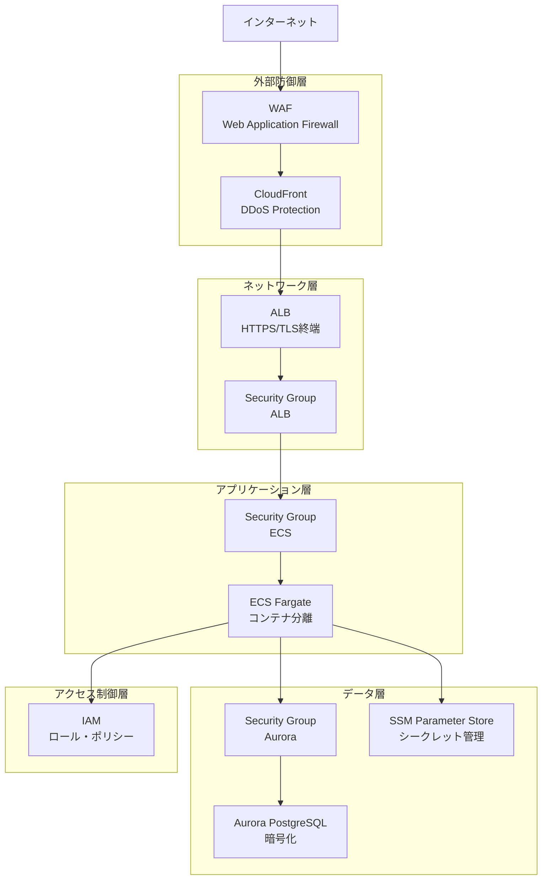

# セキュリティ設計

## 概要

本番環境のセキュリティ設計について記載します。OWASP Top 10対策、AWSベストプラクティス、最小権限の原則に基づいて設計します。

## セキュリティレイヤー構成



## WAF（Web Application Firewall）

### 目的

- SQLインジェクション防止
- XSS（Cross-Site Scripting）防止
- 不正なリクエストのブロック
- レートリミット
- 地域ブロック

### AWS Managed Rules

**Core Rule Set（CRS）:**

- SQLインジェクション
- XSS
- Local File Inclusion（LFI）
- Remote File Inclusion（RFI）
- コマンドインジェクション

**Known Bad Inputs:**

- 既知の脆弱性パターン
- 悪意のあるボットシグネチャ

**IP Reputation List:**

- 既知の悪意のあるIPアドレス

### カスタムルール

**レートリミット:**

- 同一IPからのリクエスト: 1000リクエスト/5分
- 管理画面ログイン試行: 10回/5分

**地域ブロック:**

- 日本以外からのアクセス制限（オプション）

### Terraform設定

```hcl
# WAF Web ACL
resource "aws_wafv2_web_acl" "main" {
  name  = "${var.project_name}-${var.environment}-waf"
  scope = "CLOUDFRONT"

  default_action {
    allow {}
  }

  # AWS Managed Rules - Core Rule Set
  rule {
    name     = "AWSManagedRulesCommonRuleSet"
    priority = 1

    override_action {
      none {}
    }

    statement {
      managed_rule_group_statement {
        vendor_name = "AWS"
        name        = "AWSManagedRulesCommonRuleSet"
      }
    }

    visibility_config {
      cloudwatch_metrics_enabled = true
      metric_name                = "AWSManagedRulesCommonRuleSetMetric"
      sampled_requests_enabled   = true
    }
  }

  # AWS Managed Rules - Known Bad Inputs
  rule {
    name     = "AWSManagedRulesKnownBadInputsRuleSet"
    priority = 2

    override_action {
      none {}
    }

    statement {
      managed_rule_group_statement {
        vendor_name = "AWS"
        name        = "AWSManagedRulesKnownBadInputsRuleSet"
      }
    }

    visibility_config {
      cloudwatch_metrics_enabled = true
      metric_name                = "AWSManagedRulesKnownBadInputsRuleSetMetric"
      sampled_requests_enabled   = true
    }
  }

  # Rate Limiting
  rule {
    name     = "RateLimitRule"
    priority = 3

    action {
      block {}
    }

    statement {
      rate_based_statement {
        limit              = 1000
        aggregate_key_type = "IP"
      }
    }

    visibility_config {
      cloudwatch_metrics_enabled = true
      metric_name                = "RateLimitRuleMetric"
      sampled_requests_enabled   = true
    }
  }

  visibility_config {
    cloudwatch_metrics_enabled = true
    metric_name                = "${var.project_name}-${var.environment}-waf"
    sampled_requests_enabled   = true
  }

  tags = {
    Name = "${var.project_name}-${var.environment}-waf"
  }
}

# WAF Association with CloudFront
resource "aws_wafv2_web_acl_association" "cloudfront" {
  resource_arn = aws_cloudfront_distribution.main.arn
  web_acl_arn  = aws_wafv2_web_acl.main.arn
}
```

## Security Group

### 設計原則

1. **最小権限の原則**: 必要最小限のポートのみ開放
2. **階層的制御**: 各レイヤーごとに独立したSecurity Group
3. **送信元制限**: IPアドレスではなくSecurity Group IDで制御

### ALB Security Group

**インバウンド:**

| プロトコル | ポート | 送信元 | 説明 |
|-----------|--------|--------|------|
| TCP | 80 | 0.0.0.0/0 | HTTP（HTTPS リダイレクト） |
| TCP | 443 | 0.0.0.0/0 | HTTPS |

**アウトバウンド:**

| プロトコル | ポート | 送信先 | 説明 |
|-----------|--------|--------|------|
| TCP | 3000-3001 | ECS Security Group | ECSタスクへの転送 |

**Terraform設定:**

```hcl
# ALB Security Group
resource "aws_security_group" "alb" {
  name        = "${var.project_name}-${var.environment}-alb-sg"
  description = "Security group for ALB"
  vpc_id      = var.vpc_id

  ingress {
    description = "HTTP from Internet"
    from_port   = 80
    to_port     = 80
    protocol    = "tcp"
    cidr_blocks = ["0.0.0.0/0"]
  }

  ingress {
    description = "HTTPS from Internet"
    from_port   = 443
    to_port     = 443
    protocol    = "tcp"
    cidr_blocks = ["0.0.0.0/0"]
  }

  egress {
    description     = "To ECS tasks"
    from_port       = 3000
    to_port         = 3001
    protocol        = "tcp"
    security_groups = [aws_security_group.ecs.id]
  }

  tags = {
    Name = "${var.project_name}-${var.environment}-alb-sg"
  }
}
```

### ECS Security Group

**インバウンド:**

| プロトコル | ポート | 送信元 | 説明 |
|-----------|--------|--------|------|
| TCP | 3000 | ALB Security Group | Webコンテナ |
| TCP | 3001 | ALB Security Group | APIコンテナ |

**アウトバウンド:**

| プロトコル | ポート | 送信先 | 説明 |
|-----------|--------|--------|------|
| TCP | 5432 | Aurora Security Group | PostgreSQL |
| TCP | 27017 | 0.0.0.0/0 | MongoDB Atlas（外部） |
| TCP | 443 | 0.0.0.0/0 | HTTPS（外部API、VPC Endpoint） |

**Terraform設定:**

```hcl
# ECS Security Group
resource "aws_security_group" "ecs" {
  name        = "${var.project_name}-${var.environment}-ecs-sg"
  description = "Security group for ECS tasks"
  vpc_id      = var.vpc_id

  ingress {
    description     = "Web container port from ALB"
    from_port       = 3000
    to_port         = 3000
    protocol        = "tcp"
    security_groups = [aws_security_group.alb.id]
  }

  ingress {
    description     = "API container port from ALB"
    from_port       = 3001
    to_port         = 3001
    protocol        = "tcp"
    security_groups = [aws_security_group.alb.id]
  }

  egress {
    description     = "To Aurora PostgreSQL"
    from_port       = 5432
    to_port         = 5432
    protocol        = "tcp"
    security_groups = [aws_security_group.aurora.id]
  }

  egress {
    description = "To MongoDB Atlas"
    from_port   = 27017
    to_port     = 27017
    protocol    = "tcp"
    cidr_blocks = ["0.0.0.0/0"]
  }

  egress {
    description = "HTTPS to Internet and VPC Endpoints"
    from_port   = 443
    to_port     = 443
    protocol    = "tcp"
    cidr_blocks = ["0.0.0.0/0"]
  }

  tags = {
    Name = "${var.project_name}-${var.environment}-ecs-sg"
  }
}
```

### Aurora Security Group

**インバウンド:**

| プロトコル | ポート | 送信元 | 説明 |
|-----------|--------|--------|------|
| TCP | 5432 | ECS Security Group | ECSタスクからのアクセス |

**アウトバウンド:**

| プロトコル | ポート | 送信先 | 説明 |
|-----------|--------|--------|------|
| - | - | - | なし |

**Terraform設定:**

```hcl
# Aurora Security Group
resource "aws_security_group" "aurora" {
  name        = "${var.project_name}-${var.environment}-aurora-sg"
  description = "Security group for Aurora PostgreSQL"
  vpc_id      = var.vpc_id

  ingress {
    description     = "PostgreSQL from ECS tasks"
    from_port       = 5432
    to_port         = 5432
    protocol        = "tcp"
    security_groups = [aws_security_group.ecs.id]
  }

  tags = {
    Name = "${var.project_name}-${var.environment}-aurora-sg"
  }
}
```

### VPC Endpoint Security Group

**インバウンド:**

| プロトコル | ポート | 送信元 | 説明 |
|-----------|--------|--------|------|
| TCP | 443 | ECS Security Group | VPC Endpointへのアクセス |

**Terraform設定:**

```hcl
# VPC Endpoint Security Group
resource "aws_security_group" "vpc_endpoint" {
  name        = "${var.project_name}-${var.environment}-vpc-endpoint-sg"
  description = "Security group for VPC Endpoints"
  vpc_id      = var.vpc_id

  ingress {
    description     = "HTTPS from ECS tasks"
    from_port       = 443
    to_port         = 443
    protocol        = "tcp"
    security_groups = [aws_security_group.ecs.id]
  }

  tags = {
    Name = "${var.project_name}-${var.environment}-vpc-endpoint-sg"
  }
}
```

## IAM（アイデンティティ・アクセス管理）

### 設計原則

1. **最小権限の原則**: 必要最小限の権限のみ付与
2. **ロールベースアクセス制御**: IAMユーザーではなくIAMロールを使用
3. **明示的な拒否**: 必要に応じてDenyポリシーを使用

### ECS Task Execution Role

**用途:**

- ECRからのイメージプル
- CloudWatch Logsへのログ書き込み
- SSM Parameter Storeからのシークレット取得

**Terraform設定:**

```hcl
# ECS Task Execution Role
resource "aws_iam_role" "ecs_execution_role" {
  name = "${var.project_name}-${var.environment}-ecs-execution-role"

  assume_role_policy = jsonencode({
    Version = "2012-10-17"
    Statement = [
      {
        Action = "sts:AssumeRole"
        Effect = "Allow"
        Principal = {
          Service = "ecs-tasks.amazonaws.com"
        }
      }
    ]
  })

  tags = {
    Name = "${var.project_name}-${var.environment}-ecs-execution-role"
  }
}

# AWS Managed Policy
resource "aws_iam_role_policy_attachment" "ecs_execution_role_policy" {
  role       = aws_iam_role.ecs_execution_role.name
  policy_arn = "arn:aws:iam::aws:policy/service-role/AmazonECSTaskExecutionRolePolicy"
}

# SSM Parameter Store Access
resource "aws_iam_role_policy" "ecs_ssm_policy" {
  name = "${var.project_name}-${var.environment}-ecs-ssm-policy"
  role = aws_iam_role.ecs_execution_role.id

  policy = jsonencode({
    Version = "2012-10-17"
    Statement = [
      {
        Action = [
          "ssm:GetParameters",
          "ssm:GetParameter"
        ]
        Effect = "Allow"
        Resource = [
          "arn:aws:ssm:${var.aws_region}:${data.aws_caller_identity.current.account_id}:parameter/${var.project_name}/${var.environment}/*"
        ]
      },
      {
        Action = [
          "kms:Decrypt"
        ]
        Effect = "Allow"
        Resource = [
          "arn:aws:kms:${var.aws_region}:${data.aws_caller_identity.current.account_id}:key/*"
        ]
      }
    ]
  })
}
```

### ECS Task Role

**用途:**

- S3バケットへのアクセス
- SSMセッションマネージャー接続
- その他のAWSサービスへのアクセス

**Terraform設定:**

```hcl
# ECS Task Role
resource "aws_iam_role" "ecs_task_role" {
  name = "${var.project_name}-${var.environment}-ecs-task-role"

  assume_role_policy = jsonencode({
    Version = "2012-10-17"
    Statement = [
      {
        Action = "sts:AssumeRole"
        Effect = "Allow"
        Principal = {
          Service = "ecs-tasks.amazonaws.com"
        }
      }
    ]
  })

  tags = {
    Name = "${var.project_name}-${var.environment}-ecs-task-role"
  }
}

# S3 Access Policy
resource "aws_iam_role_policy" "ecs_s3_policy" {
  name = "${var.project_name}-${var.environment}-ecs-s3-policy"
  role = aws_iam_role.ecs_task_role.id

  policy = jsonencode({
    Version = "2012-10-17"
    Statement = [
      {
        Action = [
          "s3:GetObject",
          "s3:PutObject",
          "s3:DeleteObject"
        ]
        Effect = "Allow"
        Resource = [
          "${aws_s3_bucket.assets.arn}/*"
        ]
      },
      {
        Action = [
          "s3:ListBucket"
        ]
        Effect = "Allow"
        Resource = [
          aws_s3_bucket.assets.arn
        ]
      }
    ]
  })
}

# SSM Session Manager Policy
resource "aws_iam_role_policy" "ecs_ssm_session_policy" {
  name = "${var.project_name}-${var.environment}-ecs-ssm-session-policy"
  role = aws_iam_role.ecs_task_role.id

  policy = jsonencode({
    Version = "2012-10-17"
    Statement = [
      {
        Action = [
          "ssmmessages:CreateControlChannel",
          "ssmmessages:CreateDataChannel",
          "ssmmessages:OpenControlChannel",
          "ssmmessages:OpenDataChannel"
        ]
        Effect = "Allow"
        Resource = "*"
      }
    ]
  })
}
```

## シークレット管理

### SSM Parameter Store

**管理対象:**

- DATABASE_URL（Aurora接続文字列）
- MONGODB_URI（MongoDB接続文字列）
- JWT_SECRET（JWT署名鍵）
- DATADOG_API_KEY
- SENTRY_DSN
- その他のAPIキー

**暗号化:**

- AWS KMS（Key Management Service）による暗号化
- SecureStringタイプを使用

**アクセス制御:**

- IAMロールによる厳格な権限管理
- パラメータパスによるアクセス制御

**Terraform設定:**

```hcl
# DATABASE_URL
resource "aws_ssm_parameter" "database_url" {
  name        = "/${var.project_name}/${var.environment}/DATABASE_URL"
  description = "Database connection URL for Prisma"
  type        = "SecureString"
  value       = "postgresql://${var.db_username}:${random_password.aurora_password.result}@${aws_rds_cluster.main.endpoint}:5432/${var.db_name}?schema=public"

  tags = {
    Name = "${var.project_name}-${var.environment}-database-url"
  }
}

# MONGODB_URI
resource "aws_ssm_parameter" "mongodb_uri" {
  name        = "/${var.project_name}/${var.environment}/MONGODB_URI"
  description = "MongoDB connection string"
  type        = "SecureString"
  value       = var.mongodb_uri

  tags = {
    Name = "${var.project_name}-${var.environment}-mongodb-uri"
  }
}

# JWT_SECRET
resource "aws_ssm_parameter" "jwt_secret" {
  name        = "/${var.project_name}/${var.environment}/JWT_SECRET"
  description = "JWT signing secret"
  type        = "SecureString"
  value       = random_password.jwt_secret.result

  tags = {
    Name = "${var.project_name}-${var.environment}-jwt-secret"
  }
}
```

## データ暗号化

### 保管時の暗号化

**Aurora PostgreSQL:**

- AWS KMSによる暗号化
- デフォルトで有効化

**S3:**

- AES-256暗号化
- サーバー側暗号化（SSE-S3）

**CloudWatch Logs:**

- KMS暗号化オプション

**Terraform設定:**

```hcl
# Aurora暗号化
resource "aws_rds_cluster" "main" {
  # ... 他の設定 ...

  storage_encrypted = true
  kms_key_id        = aws_kms_key.rds.arn
}

# S3暗号化
resource "aws_s3_bucket_server_side_encryption_configuration" "assets" {
  bucket = aws_s3_bucket.assets.id

  rule {
    apply_server_side_encryption_by_default {
      sse_algorithm = "AES256"
    }
  }
}
```

### 転送時の暗号化

**HTTPS/TLS:**

- CloudFront: TLS 1.2以上
- ALB: TLS 1.2以上
- Aurora: TLS 1.2以上
- MongoDB Atlas: TLS 1.2以上

**Terraform設定:**

```hcl
# ALB HTTPS Listener
resource "aws_lb_listener" "https" {
  load_balancer_arn = aws_lb.main.arn
  port              = "443"
  protocol          = "HTTPS"
  ssl_policy        = "ELBSecurityPolicy-TLS-1-2-2017-01"
  certificate_arn   = aws_acm_certificate.main.arn

  default_action {
    type             = "forward"
    target_group_arn = aws_lb_target_group.web.arn
  }
}
```

## OWASP Top 10対策

| 脅威 | 対策 |
|------|------|
| A01: Broken Access Control | IAMロール、Security Group、WAF |
| A02: Cryptographic Failures | KMS暗号化、TLS 1.2以上 |
| A03: Injection | WAF（SQLインジェクション対策）、Prisma（パラメータ化クエリ） |
| A04: Insecure Design | セキュアアーキテクチャ設計 |
| A05: Security Misconfiguration | Terraformによる一貫性のある設定管理 |
| A06: Vulnerable Components | 定期的な依存パッケージ更新、Dependabot |
| A07: Authentication Failures | JWT、セッション管理、レートリミット |
| A08: Software and Data Integrity Failures | コンテナイメージ署名、GitHub Actions検証 |
| A09: Security Logging and Monitoring | CloudWatch、Datadog、Sentry |
| A10: Server-Side Request Forgery (SSRF) | VPC分離、アウトバウンド制限 |

## セキュリティ監視

### CloudWatch Alarms

**監視項目:**

- 異常なトラフィック増加
- 5xxエラー率上昇
- 不正なログインパターン
- WAFブロック数増加

### Datadog

**監視項目:**

- APM（トレース）
- セキュリティイベント
- 異常検知

### Sentry

**監視項目:**

- アプリケーションエラー
- パフォーマンス低下
- セキュリティ関連の例外

## インシデント対応

### 手順

1. **検知**: CloudWatch / Datadog / Sentryによる自動アラート
2. **初動対応**: 影響範囲の特定、一時的な緩和策
3. **調査**: ログ分析、トラフィック分析
4. **恒久対策**: 脆弱性修正、セキュリティ強化
5. **事後分析**: インシデントレポート作成、再発防止策

### エスカレーション

1. 開発チーム → チームリーダー
2. チームリーダー → セキュリティ責任者
3. セキュリティ責任者 → 経営層

## コンプライアンス

### データ保護

- **個人情報**: 暗号化、アクセス制御
- **ログ保持期間**: 法令準拠（最低1年）
- **バックアップ**: 7日間保持

### 監査ログ

- CloudTrail: AWSリソース操作ログ
- VPCフローログ: ネットワークトラフィック
- CloudWatch Logs: アプリケーションログ

## 定期的なセキュリティレビュー

### 月次

- WAFログレビュー
- Security Groupルールレビュー
- IAMポリシーレビュー

### 四半期

- 脆弱性スキャン
- ペネトレーションテスト（外部委託）
- セキュリティパッチ適用

### 年次

- セキュリティ監査（外部委託）
- ディザスタリカバリ訓練

## 参考リンク

- [AWS Security Best Practices](https://aws.amazon.com/security/best-practices/)
- [OWASP Top 10](https://owasp.org/www-project-top-ten/)
- [AWS WAF Documentation](https://docs.aws.amazon.com/waf/)
- [AWS IAM Documentation](https://docs.aws.amazon.com/iam/)
