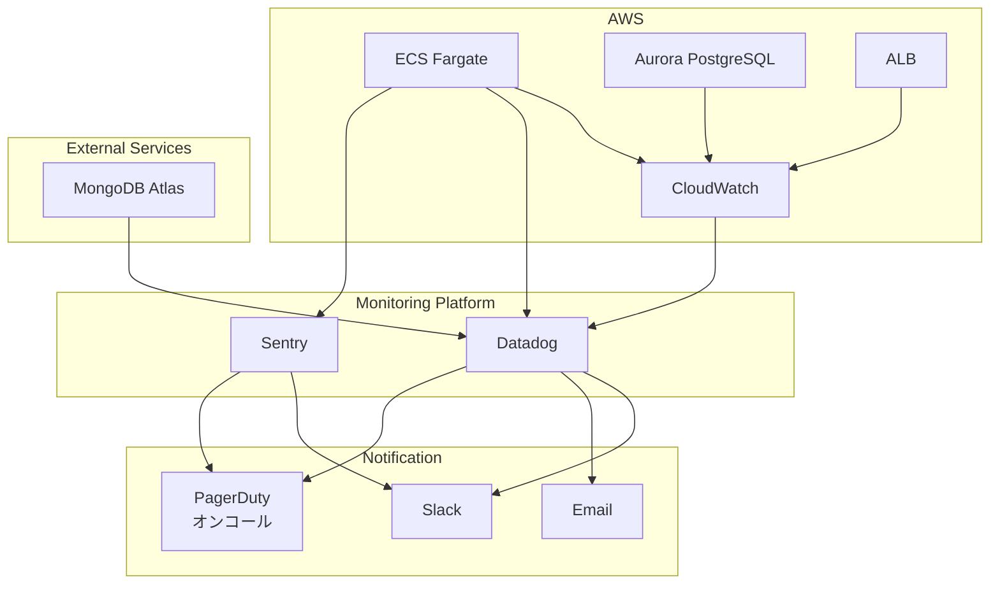

# モニタリング設計

## 概要

本番環境のモニタリング・ロギング・アラート設計について記載します。可用性99.9％以上を維持し、障害を早期検知・対応するための仕組みを構築します。

## モニタリング全体像



## モニタリングツール

### CloudWatch

**用途:**

- AWSリソースのメトリクス収集
- ログ管理
- アラーム設定

**メトリクス:**

- ECS: CPU使用率、メモリ使用率、タスク数
- Aurora: 接続数、クエリレイテンシ、ストレージ使用量
- ALB: リクエスト数、レスポンスタイム、エラー率

### Datadog

**用途:**

- 統合監視プラットフォーム
- APM（Application Performance Monitoring）
- インフラストラクチャ監視
- ログ管理
- ダッシュボード

**主要機能:**

- トレース（分散トレーシング）
- メトリクス（カスタムメトリクス）
- ログ（ログ集約・検索）
- アラート（異常検知）

### Sentry

**用途:**

- エラートラッキング
- パフォーマンス監視
- リリーストラッキング

**主要機能:**

- エラースタックトレース
- パンくずリスト（ユーザー行動）
- リリース追跡
- アラート通知

## メトリクス設計

### インフラメトリクス

#### ECS Fargate

| メトリクス        | 説明           | 閾値 | アラート |
| ----------------- | -------------- | ---- | -------- |
| CPUUtilization    | CPU使用率      | 80%  | Warning  |
|                   |                | 90%  | Critical |
| MemoryUtilization | メモリ使用率   | 80%  | Warning  |
|                   |                | 90%  | Critical |
| RunningTaskCount  | 実行中タスク数 | < 1  | Critical |
| DesiredTaskCount  | 期待タスク数   | -    | -        |

#### Aurora PostgreSQL

| メトリクス                 | 説明               | 閾値    | アラート |
| -------------------------- | ------------------ | ------- | -------- |
| DatabaseConnections        | DB接続数           | > 80    | Warning  |
|                            |                    | > 100   | Critical |
| CPUUtilization             | CPU使用率          | 70%     | Warning  |
|                            |                    | 85%     | Critical |
| FreeableMemory             | 空きメモリ         | < 500MB | Warning  |
|                            |                    | < 200MB | Critical |
| ReadLatency                | 読み取りレイテンシ | > 10ms  | Warning  |
|                            |                    | > 50ms  | Critical |
| WriteLatency               | 書き込みレイテンシ | > 10ms  | Warning  |
|                            |                    | > 50ms  | Critical |
| AuroraVolumeBytesLeftTotal | 残りストレージ     | < 10GB  | Warning  |

#### ALB

| メトリクス                | 説明             | 閾値       | アラート |
| ------------------------- | ---------------- | ---------- | -------- |
| TargetResponseTime        | レスポンスタイム | > 1s       | Warning  |
|                           |                  | > 3s       | Critical |
| HTTPCode_Target_5XX_Count | 5xxエラー数      | > 10/5min  | Warning  |
|                           |                  | > 50/5min  | Critical |
| HTTPCode_Target_4XX_Count | 4xxエラー数      | > 100/5min | Warning  |
| UnHealthyHostCount        | 異常ホスト数     | > 0        | Critical |
| RequestCount              | リクエスト数     | -          | -        |

### アプリケーションメトリクス

#### Next.js Web

| メトリクス            | 説明               | 閾値     | アラート |
| --------------------- | ------------------ | -------- | -------- |
| http.request.duration | リクエスト処理時間 | p95 > 1s | Warning  |
|                       |                    | p95 > 3s | Critical |
| http.request.errors   | HTTPエラー率       | > 1%     | Warning  |
|                       |                    | > 5%     | Critical |
| memory.heap.used      | ヒープメモリ使用量 | > 700MB  | Warning  |
|                       |                    | > 900MB  | Critical |

#### NestJS API

| メトリクス                 | 説明               | 閾値        | アラート |
| -------------------------- | ------------------ | ----------- | -------- |
| http.request.duration      | リクエスト処理時間 | p95 > 500ms | Warning  |
|                            |                    | p95 > 2s    | Critical |
| http.request.errors        | HTTPエラー率       | > 1%        | Warning  |
|                            |                    | > 5%        | Critical |
| database.query.duration    | DBクエリ時間       | p95 > 100ms | Warning  |
|                            |                    | p95 > 500ms | Critical |
| database.connection.active | アクティブDB接続数 | > 50        | Warning  |
|                            |                    | > 80        | Critical |

## ロギング設計

### ログレベル

| レベル | 説明     | 用途                         |
| ------ | -------- | ---------------------------- |
| ERROR  | エラー   | アプリケーションエラー、例外 |
| WARN   | 警告     | 潜在的な問題、非推奨機能使用 |
| INFO   | 情報     | 重要なイベント、状態変更     |
| DEBUG  | デバッグ | 詳細なデバッグ情報           |

### ログ出力先

**本番環境:**

- CloudWatch Logs（すべてのログ）
- Datadog（ERROR、WARN、INFO）
- Sentry（ERROR）

**Staging環境:**

- CloudWatch Logs（すべてのログ）

### ログフォーマット

**JSON形式:**

```json
{
  "timestamp": "2025-01-15T12:34:56.789Z",
  "level": "ERROR",
  "service": "api-core",
  "environment": "production",
  "message": "Database connection failed",
  "error": {
    "name": "ConnectionError",
    "message": "Connection timeout",
    "stack": "Error: Connection timeout\n  at ..."
  },
  "context": {
    "userId": "user123",
    "requestId": "req-abc123",
    "traceId": "trace-xyz789"
  }
}
```

### ログ保持期間

| ログタイプ           | CloudWatch | Datadog | MongoDB Atlas |
| -------------------- | ---------- | ------- | ------------- |
| アプリケーションログ | 30日       | 15日    | 30日          |
| アクセスログ         | 30日       | 15日    | -             |
| エラーログ           | 90日       | 30日    | -             |
| 監査ログ             | 365日      | 90日    | -             |

### CloudWatch Logs設定

```hcl
# CloudWatch Log Group（Web）
resource "aws_cloudwatch_log_group" "web" {
  name              = "/ecs/${var.project_name}-${var.environment}-web"
  retention_in_days = 30

  tags = {
    Name = "${var.project_name}-${var.environment}-web-logs"
  }
}

# CloudWatch Log Group（API）
resource "aws_cloudwatch_log_group" "api" {
  name              = "/ecs/${var.project_name}-${var.environment}-api"
  retention_in_days = 30

  tags = {
    Name = "${var.project_name}-${var.environment}-api-logs"
  }
}

# CloudWatch Log Group（ALB）
resource "aws_cloudwatch_log_group" "alb" {
  name              = "/aws/alb/${var.project_name}-${var.environment}"
  retention_in_days = 30

  tags = {
    Name = "${var.project_name}-${var.environment}-alb-logs"
  }
}
```

## アラート設計

### アラート重要度

| 重要度   | 説明                           | 通知先                  | 対応時間  |
| -------- | ------------------------------ | ----------------------- | --------- |
| Critical | サービス停止、重大な障害       | Slack、Email、PagerDuty | 即座      |
| Warning  | パフォーマンス低下、潜在的問題 | Slack、Email            | 1時間以内 |
| Info     | 情報提供、統計                 | Slack                   | -         |

### CloudWatch Alarms

#### ECS CPU使用率（Critical）

```hcl
resource "aws_cloudwatch_metric_alarm" "ecs_cpu_high" {
  alarm_name          = "${var.project_name}-${var.environment}-ecs-cpu-high"
  comparison_operator = "GreaterThanThreshold"
  evaluation_periods  = "2"
  metric_name         = "CPUUtilization"
  namespace           = "AWS/ECS"
  period              = "300"
  statistic           = "Average"
  threshold           = "90"
  alarm_description   = "ECS CPU utilization is too high"
  alarm_actions       = [aws_sns_topic.critical.arn]

  dimensions = {
    ClusterName = aws_ecs_cluster.main.name
    ServiceName = aws_ecs_service.api.name
  }

  tags = {
    Name     = "${var.project_name}-${var.environment}-ecs-cpu-high"
    Severity = "Critical"
  }
}
```

#### Aurora接続数（Warning）

```hcl
resource "aws_cloudwatch_metric_alarm" "aurora_connections_high" {
  alarm_name          = "${var.project_name}-${var.environment}-aurora-connections-high"
  comparison_operator = "GreaterThanThreshold"
  evaluation_periods  = "2"
  metric_name         = "DatabaseConnections"
  namespace           = "AWS/RDS"
  period              = "300"
  statistic           = "Average"
  threshold           = "80"
  alarm_description   = "Aurora database connections are high"
  alarm_actions       = [aws_sns_topic.warning.arn]

  dimensions = {
    DBClusterIdentifier = aws_rds_cluster.main.cluster_identifier
  }

  tags = {
    Name     = "${var.project_name}-${var.environment}-aurora-connections-high"
    Severity = "Warning"
  }
}
```

#### ALB 5xxエラー（Critical）

```hcl
resource "aws_cloudwatch_metric_alarm" "alb_5xx_errors" {
  alarm_name          = "${var.project_name}-${var.environment}-alb-5xx-errors"
  comparison_operator = "GreaterThanThreshold"
  evaluation_periods  = "2"
  metric_name         = "HTTPCode_Target_5XX_Count"
  namespace           = "AWS/ApplicationELB"
  period              = "300"
  statistic           = "Sum"
  threshold           = "50"
  alarm_description   = "ALB 5xx errors are too high"
  alarm_actions       = [aws_sns_topic.critical.arn]

  dimensions = {
    LoadBalancer = aws_lb.main.arn_suffix
  }

  tags = {
    Name     = "${var.project_name}-${var.environment}-alb-5xx-errors"
    Severity = "Critical"
  }
}
```

### Datadog Monitors

#### API Error Rate（Critical）

```hcl
resource "datadog_monitor" "api_error_rate" {
  name    = "${var.project_name}-${var.environment} API Error Rate"
  type    = "metric alert"
  message = <<-EOT
    **API error rate is too high**

    Current error rate: {{value}}%

    @slack-critical
    @pagerduty-oncall
  EOT

  query = "avg(last_5m):sum:trace.express.request.errors{env:${var.environment}} / sum:trace.express.request.hits{env:${var.environment}} * 100 > 5"

  thresholds = {
    critical = 5
    warning  = 1
  }

  notify_no_data    = true
  no_data_timeframe = 10
  renotify_interval = 60

  tags = [
    "env:${var.environment}",
    "service:api-core",
    "severity:critical"
  ]
}
```

#### Database Query Performance（Warning）

```hcl
resource "datadog_monitor" "db_query_slow" {
  name    = "${var.project_name}-${var.environment} Slow Database Queries"
  type    = "metric alert"
  message = <<-EOT
    **Database queries are slow**

    P95 latency: {{value}}ms

    @slack-warning
  EOT

  query = "avg(last_10m):p95:trace.postgres.query.duration{env:${var.environment}} > 500"

  thresholds = {
    critical = 500
    warning  = 100
  }

  tags = [
    "env:${var.environment}",
    "service:api-core",
    "severity:warning"
  ]
}
```

### Sentry Alerts

#### High Error Rate

- 5分間に10件以上のエラー発生
- 同一エラーが1時間に50件以上発生
- 新しいタイプのエラー検知

#### Performance Degradation

- トランザクション処理時間がベースラインの2倍以上
- LCP（Largest Contentful Paint）が3秒以上

## 通知設定

### SNS Topic

```hcl
# Critical Alerts
resource "aws_sns_topic" "critical" {
  name = "${var.project_name}-${var.environment}-critical-alerts"

  tags = {
    Name = "${var.project_name}-${var.environment}-critical-alerts"
  }
}

# Warning Alerts
resource "aws_sns_topic" "warning" {
  name = "${var.project_name}-${var.environment}-warning-alerts"

  tags = {
    Name = "${var.project_name}-${var.environment}-warning-alerts"
  }
}

# SNS to Slack（Lambda経由）
resource "aws_sns_topic_subscription" "critical_to_slack" {
  topic_arn = aws_sns_topic.critical.arn
  protocol  = "lambda"
  endpoint  = aws_lambda_function.sns_to_slack.arn
}
```

### Slack通知

**チャンネル:**

- `#alerts-critical`: Critical アラート
- `#alerts-warning`: Warning アラート
- `#monitoring`: メトリクスダッシュボード、定期レポート

**通知フォーマット:**

```txt
🚨 **Critical Alert**

**Service**: API Core
**Environment**: Production
**Alert**: ECS CPU High
**Value**: 95%
**Threshold**: 90%
**Time**: 2025-01-15 12:34:56 JST

[View in CloudWatch](link) | [View in Datadog](link)
```

## ダッシュボード

### CloudWatch Dashboard

**システム概要:**

- ECS CPU/メモリ使用率（グラフ）
- Aurora接続数（グラフ）
- ALBリクエスト数（グラフ）
- ALBエラー率（グラフ）

```hcl
resource "aws_cloudwatch_dashboard" "main" {
  dashboard_name = "${var.project_name}-${var.environment}"

  dashboard_body = jsonencode({
    widgets = [
      {
        type = "metric"
        properties = {
          metrics = [
            ["AWS/ECS", "CPUUtilization", { stat = "Average" }],
            [".", "MemoryUtilization", { stat = "Average" }]
          ]
          period = 300
          stat   = "Average"
          region = var.aws_region
          title  = "ECS CPU & Memory"
        }
      },
      {
        type = "metric"
        properties = {
          metrics = [
            ["AWS/RDS", "DatabaseConnections", { stat = "Average" }],
            [".", "CPUUtilization", { stat = "Average" }]
          ]
          period = 300
          stat   = "Average"
          region = var.aws_region
          title  = "Aurora Metrics"
        }
      }
    ]
  })
}
```

### Datadog Dashboard

**APMダッシュボード:**

- リクエスト数（時系列）
- エラー率（時系列）
- レスポンスタイム分布（ヒートマップ）
- トップエンドポイント（テーブル）

**インフラダッシュボード:**

- ホストマップ（CPU/メモリ使用率）
- コンテナリソース（CPU/メモリ）
- ネットワークトラフィック（送受信）

## SLI / SLO / SLA

### SLI（Service Level Indicator）

| 指標       | 計測方法                          |
| ---------- | --------------------------------- |
| 可用性     | 正常レスポンス数 / 総リクエスト数 |
| レイテンシ | p95レスポンスタイム               |
| エラー率   | 5xxエラー数 / 総リクエスト数      |

### SLO（Service Level Objective）

| 指標              | 目標値     | 計測期間 |
| ----------------- | ---------- | -------- |
| 可用性            | 99.9％以上 | 月次     |
| レイテンシ（p95） | 1秒以内    | 月次     |
| エラー率          | 0.1％以下  | 月次     |

### SLA（Service Level Agreement）

- 可用性: 99.9％（月間ダウンタイム43.2分以内）
- サポート対応: 24時間365日
- 障害通知: 15分以内

## オンコール体制

### オンコール担当

- プライマリ: 開発チームリーダー
- セカンダリ: バックエンドエンジニア
- エスカレーション: CTO

### オンコール時間帯

- 平日: 9:00〜18:00（通常対応）
- 夜間・休日: PagerDutyによる自動通知

### オンコールローテーション

- 1週間単位でローテーション
- PagerDutyで管理

## 定期レポート

### 日次レポート

- SLI達成状況
- エラー発生件数
- リクエスト数推移

### 週次レポート

- SLO達成状況
- パフォーマンスサマリー
- インシデント一覧

### 月次レポート

- SLA達成状況
- コスト分析
- キャパシティ計画
- インシデント分析

## トラブルシューティング

### ログ検索（CloudWatch Insights）

**エラーログ検索:**

```txt
fields @timestamp, level, message, error.message
| filter level = "ERROR"
| sort @timestamp desc
| limit 100
```

**スロークエリ検索:**

```txt
fields @timestamp, database.query.duration, database.query.sql
| filter database.query.duration > 1000
| sort database.query.duration desc
| limit 50
```

### メトリクス分析（Datadog）

**レイテンシ分析:**

```txt
avg:trace.express.request.duration{env:production} by {resource_name}
```

**エラー率分析:**

```txt
sum:trace.express.request.errors{env:production} / sum:trace.express.request.hits{env:production} * 100
```

## 環境別設定

### Staging環境（検証環境）

検証環境では無料枠内に収めるため、最小限の設定とします。

#### Datadog設定

- **サンプリング率**: 5%
- **レート制限**: 10スパン/秒
- **プロファイリング**: 無効
- **ランタイムメトリクス**: 無効

**環境変数:**

```bash
NODE_ENV=staging
DD_ENV=staging
DD_SERVICE=bookmark-api
DD_VERSION=1.0.0
```

#### Sentry設定

**バックエンド（NestJS）:**

- 適用なし（Sentryはフロントエンドのみ使用）

**フロントエンド（Next.js）:**

- **エラー記録**: 100％（sampleRate: 1.0）
- **トレースサンプリング**: 5%
- **APIルート**: 20%
- **ページビュー**: 5%
- **セッションリプレイ**: 無効（通常時・エラー時ともに0％）

**環境変数:**

```bash
NODE_ENV=staging
NEXT_PUBLIC_SENTRY_DSN=https://xxxxx@xxxxx.ingest.sentry.io/xxxxx
```

### Production環境（本番環境）

本番環境では実用的な設定で、適切な監視を実現します。

#### Datadog設定

- **サンプリング率**: 20%
- **レート制限**: 50スパン/秒
- **プロファイリング**: 有効
- **ランタイムメトリクス**: 有効

**環境変数:**

```bash
NODE_ENV=production
DD_ENV=production
DD_SERVICE=bookmark-api
DD_VERSION=1.0.0
DD_AGENT_HOST=localhost
DD_TRACE_AGENT_PORT=8126
```

#### Sentry設定

**バックエンド（NestJS）:**

- 適用なし（Sentryはフロントエンドのみ使用）

**フロントエンド（Next.js）:**

- **エラー記録**: 100％（sampleRate: 1.0）
- **トレースサンプリング**: 20%
- **APIルート**: 100%
- **ページビュー**: 20%
- **セッションリプレイ**:
  - 通常時: 無効（0％）
  - エラー時: 10%

**環境変数:**

```bash
NODE_ENV=production
NEXT_PUBLIC_SENTRY_DSN=https://xxxxx@xxxxx.ingest.sentry.io/xxxxx
SENTRY_DSN=https://xxxxx@xxxxx.ingest.sentry.io/xxxxx
```

### 環境別設定の実装箇所

#### バックエンド（NestJS）

**ファイル:** `src/apps/web-api/core/src/main.ts`

Datadog設定は環境変数 `NODE_ENV` に基づいて動的に切り替わります。

#### フロントエンド（Next.js）

**ファイル:**

- `src/apps/frontend/web/instrumentation-client.ts`（クライアントサイド）
- `src/apps/frontend/web/sentry.server.config.ts`（サーバーサイド）
- `src/apps/frontend/web/sentry.edge.config.ts`（Edgeランタイム）

Sentry設定は環境変数 `NODE_ENV` に基づいて動的に切り替わります。

## コスト最適化

### CloudWatch Logs

- 保持期間: 30日（90日から削減）
- ログフィルタリング: DEBUGログは本番環境では出力しない

### Datadog

- ログサンプリング: 全ログではなく重要ログのみ送信
- メトリクス絞り込み: 必要なメトリクスのみ収集
- 環境別サンプリング: staging=5％, production=20%

### Sentry

- トレースサンプリング: staging=5％, production=20%
- セッションリプレイ: stagingでは無効、productionでエラー時のみ10%

### 推定コスト

#### Staging環境

| サービス                 | 月額   | 備考               |
| ------------------------ | ------ | ------------------ |
| CloudWatch Logs（1GB）   | $0.5   | 無料枠一部利用     |
| CloudWatch Alarms（5個） | $0.5   |                    |
| Datadog                  | $0     | 無料トライアル利用 |
| Sentry（Developer）      | $0     | 無料枠利用         |
| **合計**                 | **$1** |                    |

#### Production環境

| サービス                  | 月額    |
| ------------------------- | ------- |
| CloudWatch Logs（10GB）   | $5      |
| CloudWatch Alarms（10個） | $1      |
| Datadog（2ホスト）        | $30     |
| Sentry（Teamプラン）      | $26     |
| **合計**                  | **$62** |

## 参考リンク

- [CloudWatch Documentation](https://docs.aws.amazon.com/cloudwatch/)
- [Datadog Documentation](https://docs.datadoghq.com/)
- [Sentry Documentation](https://docs.sentry.io/)
- [Google SRE Books](https://sre.google/books/)
