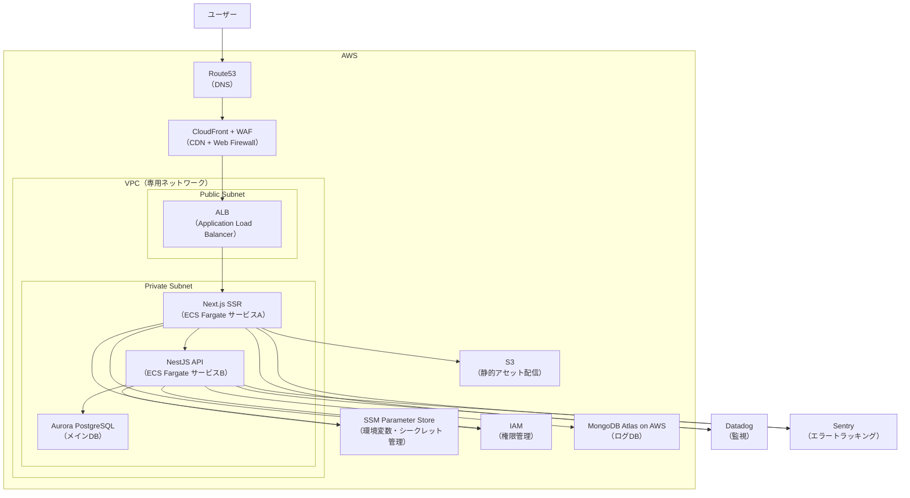
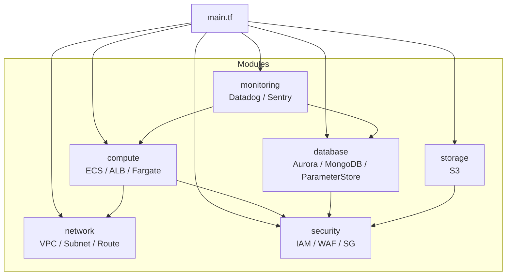

# インフラ

## 概要

- AWS上に構築されたフルスタックTypeScriptアプリケーションのインフラ基盤
- TerraformによるIaC管理
- Dockerを用いたローカル開発環境
- モニタリングにはDatadog / Sentryを導入
- データ層はRDB（PostgreSQL）とNoSQL（MongoDB）を用途別に併用

## 使用技術一覧


| 名称                                                        | 概要                                                                             | バージョン                                                                 | 備考                                  |
| ----------------------------------------------------------- | -------------------------------------------------------------------------------- | -------------------------------------------------------------------------- | ------------------------------------- |
| [AWS](https://docs.aws.amazon.com/ja_jp/)                   | クラウドインフラ基盤                                                             |                                                                            | 本番環境ホスティング                  |
| [Terraform](https://developer.hashicorp.com/terraform/docs) | IaC（Infrastructure as Code）ツール。AWSリソースの構築・変更・削除をコードで管理 |                                                                            |                                       |
| [Datadog](https://docs.datadoghq.com/ja/)                   | モニタリング                                                                     |                                                                            |                                       |
| [Sentry](https://docs.sentry.io/)                           | エラートラッキング / パフォーマンス監視                                          |                                                                            |                                       |
| [Docker Compose](https://docs.docker.jp/index.html)         | コンテナ統合管理                                                                 | [3.9](https://docs.docker.jp/compose/compose-file/compose-versioning.html) |                                       |
| [PostgreSQL](https://www.postgresql.org/docs/)              | メインDB（RDB）                                                                  | [17](https://www.postgresql.org/support/versioning/)                       | アプリデータ管理 / Prisma経由で永続化 |
| [MongoDB](https://www.mongodb.com/ja-jp/docs/)              | ログDB（NoSQL）                                                                  | [8.0](https://www.mongodb.com/legal/support-policy/lifecycles)             |                                       |
| [DBeaver](https://dbeaver.com/docs/dbeaver/)                | DBクライアント                                                                   |                                                                            |                                       |
|                                                             |                                                                                  |                                                                            |                                       |

## アーキテクチャ構成図

TODO: draw.ioに置き換え。



## Terraform × AWS

### 概要（Terraform × AWS）

Infrastructure as Code (IaC) を活用し、Terraform により、AWS上にWebアプリを構築・デプロイする。

### 目的

手作業のインフラ構築を排除し、コードによる一貫性・再現性・自動化を実現することで、運用コストの削減・信頼性向上・スケーラビリティ対応を目指す。

### AWSサービス

| カテゴリ         | AWSサービス         | 役割・説明                                                                                   |
| ---------------- | ------------------- | -------------------------------------------------------------------------------------------- |
| DNS              | Route53             | 独自ドメインを管理し、CloudFrontやALBなど各AWSリソースへのルーティングを行う                 |
| セキュリティ     | WAF                 | 不正アクセス（SQLインジェクションやXSSなど）を防止するWebアプリケーションファイアウォール    |
| CDN配信          | CloudFront          | S3やALBをオリジンとし、静的ファイルやSSRページを低遅延でキャッシュ配信する                   |
| ネットワーク基盤 | VPC                 | AWS上に構築する専用のネットワーク空間。他のユーザーのVPCと完全に分離される                   |
| ネットワーク基盤 | Public Subnet       | インターネットから直接アクセス可能なサブネット。ALBなどパブリック向けリソースを配置          |
| ネットワーク基盤 | Private Subnet      | インターネットから直接アクセスできないサブネット。ECSタスクやDBなどの内部リソースを配置      |
| ロードバランサー | ALB                 | ECSタスク（Next.js SSRアプリ・Web APIコンテナ）へのHTTP/HTTPSトラフィックをルーティング      |
| コンテナ実行基盤 | ECS on Fargate      | コンテナをサーバーレスで実行。Next.js SSRアプリとWeb APIをそれぞれ独立したサービスとして稼働 |
| 静的アセット     | S3                  | 画像・CSS・JSなどの静的アセットを保存し、CloudFront経由で配信                                |
| メインDB         | Aurora PostgreSQL   | 高可用性・スケーラブルなRDB。トランザクションデータ（ユーザー、アプリデータ等）を管理        |
| ログ・分析DB     | MongoDB Atlas       | 非構造化データやアプリログ、履歴データなどを柔軟に保存・分析                                 |
| パラメータ管理   | SSM Parameter Store | アプリの環境変数やDB接続情報、APIキーなどを安全に管理・暗号化して提供                        |
| アクセス制御     | IAM                 | 各AWSサービス（ECS、SSM、S3など）へのアクセス権限をロールやポリシーで制御                    |

### Terraform構成

```txt
infra/
 ├── main.tf
 ├── variables.tf
 ├── outputs.tf
 ├── providers.tf
 ├── envs/
 │   ├── dev/
 │   ├── prod/
 │   └── staging/
 ├── modules/
 │   ├── network/                   # VPC・サブネット・ルート設定
 │   │    ├── vpc.tf
 │   │    ├── subnet.tf
 │   │    └── route_table.tf
 │   ├── security/                  # セキュリティ関連管理
 │   │    ├── iam.tf
 │   │    ├── security_group.tf
 │   │    └── waf.tf
 │   ├── compute/                   # アプリ実行環境
 │   │    ├── ecs.tf
 │   │    ├── alb.tf
 │   │    └── fargate_task.tf
 │   ├── database/                  # 永続化・シークレット管理
 │   │    ├── aurora.tf
 │   │    ├── mongodb_atlas.tf
 │   │    └── parameter_store.tf
 │   ├── storage/                   # 静的ファイル管理
 │   │    └── s3.tf
 │   └── monitoring/                # ログ・監視
 │        ├── datadog.tf
 │        └── sentry.tf
 └── terraform.tfstate
```

### Terraform構成図



### 環境構築手順

#### Terraform導入

``` bash
brew tap hashicorp/tap
brew install hashicorp/tap/terraform
brew update
brew upgrade hashicorp/tap/terraform
terraform version
```

#### AWS設定

1. AWSアカウント作成
2. IAMユーザー作成
   - 「AdministratorAccess」を持つユーザーグループ作成
   - 管理者権限を持つIAMユーザー作成
   - アクセスキー作成
3. AWS CLI設定

    ``` bash
    brew install awscli
    aws --version
    aws configure
    ```

#### Terraform & AWS準備

1. tfファイル作成
1. AWS SSMに環境変数・シークレットを保存

    ``` bash
    aws ssm put-parameter --name "/<アプリ名>/prod/<キー名>" --value "<値>" --type "<type>"
    ```

#### 構築

``` bash
# 初期化
terraform init
# 実行計画の確認
terraform plan
# 構築
terraform apply
# 削除
terraform destroy
```

### TODO

- Terraformでインフラ構築
  - リントやフォーマット
  - Terragrunt、tflint、terraform-docs
- CI/CD構築
  - GitHub ActionsでAWSにデプロイ

## TBD

- DatadogをTerraform管理
