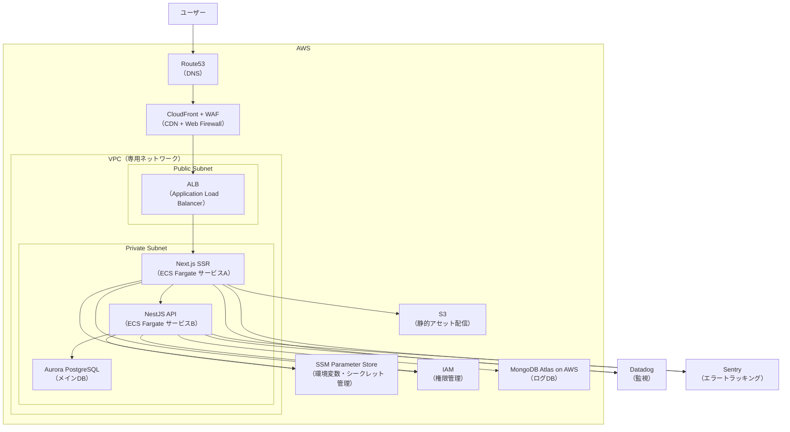
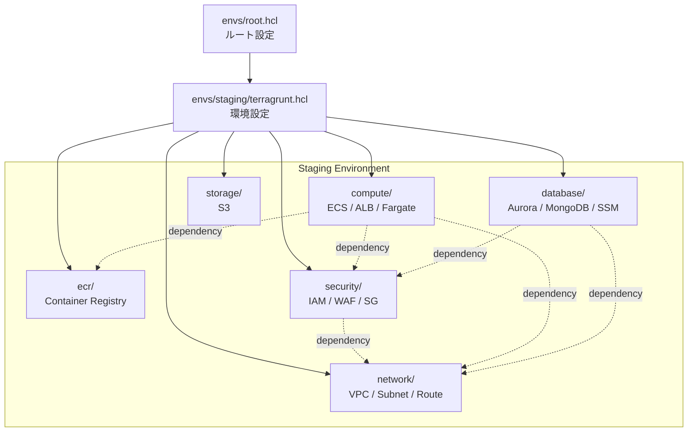

# インフラ

## 概要

- AWS上に構築されたフルスタックTypeScriptアプリケーションのインフラ基盤
- TerraformによるIaC管理
- Dockerを用いたローカル開発環境
- モニタリングにはDatadog / Sentryを導入
- データ層はRDB（PostgreSQL）とNoSQL（MongoDB）を用途別に併用

## 使用技術一覧


| 名称                                                        | 概要                                                                                | バージョン                                                                 | 備考                                  |
| ----------------------------------------------------------- | ----------------------------------------------------------------------------------- | -------------------------------------------------------------------------- | ------------------------------------- |
| [AWS](https://docs.aws.amazon.com/ja_jp/)                   | クラウドインフラ基盤                                                                |                                                                            | 本番環境ホスティング                  |
| [AWS CLI](https://docs.aws.amazon.com/cli/latest/)          | AWSサービスをコマンドラインから操作するためのツール                                 |                                                                            |                                       |
| [Terraform](https://developer.hashicorp.com/terraform/docs) | IaC（Infrastructure as Code）ツール。AWSリソースの構築・変更・削除をコードで管理    |                                                                            |                                       |
| [Terragrunt](https://terragrunt.gruntwork.io/docs/)         | Terraformのラッパーツール。肥大化しがちなtfファイルをモジュール単位で小さく管理可能 |                                                                            |                                       |
| [terraform-docs](https://terraform-docs.io/)                | Terraformコードから自動的にドキュメントを生成するためのツール                       |                                                                            |                                       |
| [TFLint](https://github.com/terraform-linters/tflint)       | Terraformコードの品質を向上させるための静的解析ツール                               |                                                                            |                                       |
| [Datadog](https://docs.datadoghq.com/ja/)                   | モニタリング                                                                        |                                                                            |                                       |
| [Sentry](https://docs.sentry.io/)                           | エラートラッキング / パフォーマンス監視                                             |                                                                            |                                       |
| [Docker Compose](https://docs.docker.jp/index.html)         | コンテナ統合管理                                                                    | [3.9](https://docs.docker.jp/compose/compose-file/compose-versioning.html) |                                       |
| [PostgreSQL](https://www.postgresql.org/docs/)              | メインDB（RDB）                                                                     | [17](https://www.postgresql.org/support/versioning/)                       | アプリデータ管理 / Prisma経由で永続化 |
| [MongoDB](https://www.mongodb.com/ja-jp/docs/)              | ログDB（NoSQL）                                                                     | [8.0](https://www.mongodb.com/legal/support-policy/lifecycles)             |                                       |
| [DBeaver](https://dbeaver.com/docs/dbeaver/)                | DBクライアント                                                                      |                                                                            |                                       |
|                                                             |                                                                                     |                                                                            |                                       |

## アーキテクチャ構成図

TODO: draw.ioに置き換え。



## Terraform × AWS

### 概要（Terraform × AWS）

Infrastructure as Code (IaC) を活用し、Terraform により、AWS上にWebアプリを構築・デプロイする。

### 目的

手作業のインフラ構築を排除し、コードによる一貫性・再現性・自動化を実現することで、運用コストの削減・信頼性向上・スケーラビリティ対応を目指す。

### AWSサービス

| カテゴリ         | AWSサービス         | 役割・説明                                                                                   |
| ---------------- | ------------------- | -------------------------------------------------------------------------------------------- |
| DNS              | Route53             | 独自ドメインを管理し、CloudFrontやALBなど各AWSリソースへのルーティングを行う                 |
| セキュリティ     | WAF                 | 不正アクセス（SQLインジェクションやXSSなど）を防止するWebアプリケーションファイアウォール    |
| CDN配信          | CloudFront          | S3やALBをオリジンとし、静的ファイルやSSRページを低遅延でキャッシュ配信する                   |
| ネットワーク基盤 | VPC                 | AWS上に構築する専用のネットワーク空間。他のユーザーのVPCと完全に分離される                   |
| ネットワーク基盤 | Public Subnet       | インターネットから直接アクセス可能なサブネット。ALBなどパブリック向けリソースを配置          |
| ネットワーク基盤 | Private Subnet      | インターネットから直接アクセスできないサブネット。ECSタスクやDBなどの内部リソースを配置      |
| ロードバランサー | ALB                 | ECSタスク（Next.js SSRアプリ・Web APIコンテナ）へのHTTP/HTTPSトラフィックをルーティング      |
| コンテナ実行基盤 | ECS on Fargate      | コンテナをサーバーレスで実行。Next.js SSRアプリとWeb APIをそれぞれ独立したサービスとして稼働 |
| 静的アセット     | S3                  | 画像・CSS・JSなどの静的アセットを保存し、CloudFront経由で配信                                |
| メインDB         | Aurora PostgreSQL   | 高可用性・スケーラブルなRDB。トランザクションデータ（ユーザー、アプリデータ等）を管理        |
| ログ・分析DB     | MongoDB Atlas       | 非構造化データやアプリログ、履歴データなどを柔軟に保存・分析                                 |
| パラメータ管理   | SSM Parameter Store | アプリの環境変数やDB接続情報、APIキーなどを安全に管理・暗号化して提供                        |
| アクセス制御     | IAM                 | 各AWSサービス（ECS、SSM、S3など）へのアクセス権限をロールやポリシーで制御                    |

### Terraform × Terragrunt構成

- Terragruntを使用してTerraformモジュールを管理

```txt
infra/terraform/
 ├── envs/                         # Terragrunt環境別設定
 │   ├── root.hcl                  # ルート設定
 │   └── staging/
 │       ├── terragrunt.hcl        # 環境共通設定
 │       ├── ecr/
 │       │   └── terragrunt.hcl
 │       ├── network/
 │       │   └── terragrunt.hcl
 │       ├── security/
 │       │   └── terragrunt.hcl
 │       ├── compute/
 │       │   └── terragrunt.hcl
 │       ├── database/
 │       │   └── terragrunt.hcl
 │       └── storage/
 │           └── terragrunt.hcl
 ├── modules/                      # 再利用可能なTerraformモジュール
 │   ├── ecr/                      # コンテナレジストリ
 │   │    ├── main.tf
 │   │    ├── variables.tf
 │   │    └── outputs.tf
 │   ├── network/                  # VPC・サブネット・ルート設定
 │   │    ├── vpc.tf
 │   │    ├── subnet.tf
 │   │    ├── route_table.tf
 │   │    ├── variables.tf
 │   │    └── outputs.tf
 │   ├── security/                 # セキュリティ関連管理
 │   │    ├── iam.tf
 │   │    ├── security_group.tf
 │   │    ├── waf.tf
 │   │    ├── variables.tf
 │   │    └── outputs.tf
 │   ├── compute/                  # アプリ実行環境
 │   │    ├── ecs.tf
 │   │    ├── alb.tf
 │   │    ├── fargate_task.tf
 │   │    ├── variables.tf
 │   │    └── outputs.tf
 │   ├── database/                 # 永続化・シークレット管理
 │   │    ├── aurora.tf
 │   │    ├── mongodb_atlas.tf
 │   │    ├── parameter_store.tf
 │   │    ├── variables.tf
 │   │    └── outputs.tf
 │   ├── storage/                  # 静的ファイル管理
 │   │    ├── s3.tf
 │   │    ├── variables.tf
 │   │    └── outputs.tf
 │   └── monitoring/               # ログ・監視（TBD）
 │        ├── datadog.tf
 │        └── sentry.tf
 └── .tflint.hcl                   # TFLint
```

### Terragrunt構成図



### 環境構築手順

#### Terraform、Terragrunt、AWS CLI導入

``` bash
# mise経由でインストール
mise install

# バージョン確認
aws --version
terraform version
terragrunt --version
tflint --version
terraform-docs --version
```

#### AWS設定

1. AWSアカウント作成
2. IAMユーザー作成
   - 「AdministratorAccess」を持つユーザーグループ作成
   - 管理者権限を持つIAMユーザー作成
   - アクセスキー作成
3. AWS CLI設定

    ``` bash
    aws configure
    ```

#### AWS SSMに環境変数・シークレットを保存

``` bash
aws ssm put-parameter \
  --name "/<アプリ名>/<環境>/<キー名>" \
  --value "<値>" \
  --type "タイプ"

# MongoDB接続文字列（MongoDB Atlas設定後）
aws ssm put-parameter \
  --name "/bookmark-manager/staging/MONGODB_URI" \
  --value "mongodb+srv://..." \
  --type "SecureString"
```

#### Terragrunt構築

##### ステップ1: ECRリポジトリの作成

```bash
cd infra/terraform/envs/staging/ecr

# 初期化
terragrunt init

# ECRリポジトリのみ先にデプロイ
terragrunt apply
```

##### ステップ2: コンテナイメージのビルド＆プッシュ

```bash
# プロジェクトルートに戻る
cd ../../../../

# AWSアカウントIDを取得
AWS_ACCOUNT_ID=$(aws sts get-caller-identity --query Account --output text)
AWS_REGION="ap-northeast-1"

# ECRログイン
aws ecr get-login-password --region ${AWS_REGION} | \
  docker login --username AWS --password-stdin ${AWS_ACCOUNT_ID}.dkr.ecr.${AWS_REGION}.amazonaws.com

# Webイメージのビルド＆プッシュ
docker build -t bookmark-manager-staging-web:latest -f src/apps/frontend/web/Dockerfile .
docker tag bookmark-manager-staging-web:latest ${AWS_ACCOUNT_ID}.dkr.ecr.${AWS_REGION}.amazonaws.com/bookmark-manager-staging-web:latest
docker push ${AWS_ACCOUNT_ID}.dkr.ecr.${AWS_REGION}.amazonaws.com/bookmark-manager-staging-web:latest

# APIイメージのビルド＆プッシュ
docker build -t bookmark-manager-staging-api:latest -f src/apps/web-api/core/Dockerfile .
docker tag bookmark-manager-staging-api:latest ${AWS_ACCOUNT_ID}.dkr.ecr.${AWS_REGION}.amazonaws.com/bookmark-manager-staging-api:latest
docker push ${AWS_ACCOUNT_ID}.dkr.ecr.${AWS_REGION}.amazonaws.com/bookmark-manager-staging-api:latest
```

##### ステップ3: 残りのインフラを構築

```bash
cd infra/terraform/envs/staging
# TFLintでAWSプロバイダーのプラグインをインストール（初回のみ）
tflint --init
# 全モジュールを初期化
terragrunt run-all init
# 実行計画の確認
terragrunt run-all pla
# インフラ構築（依存関係順に自動実行）
terragrunt run-all apply
# インフラ削除
terragrunt run-all destroy
```

#### 個別モジュール操作

``` bash
cd infra/terraform/envs/staging/network
# 初期化
terragrunt init
# 実行計画の確認
terragrunt plan
# 構築
terragrunt apply
# 削除
terragrunt destroy
```

#### コマンド

``` bash
# TFLint実行
tflint
# 構文検証
terraform validate
# フォーマット
terraform fmt
# Terragruntキャッシュクリア
find . -type d -name ".terragrunt-cache" -exec rm -rf {} +
```

### TODO

- Terraformでインフラ構築
  - terraform-docs導入
  - prod環境のTerragrunt設定作成
  - S3バックエンドへの移行（チーム開発時）
- CI/CD構築
  - GitHub ActionsでTerragruntを使用したAWSデプロイ
  - ECRへのコンテナイメージプッシュ自動化

## TBD

- DatadogやSentryをTerraform管理
