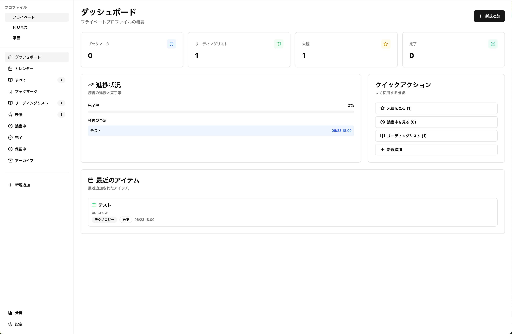
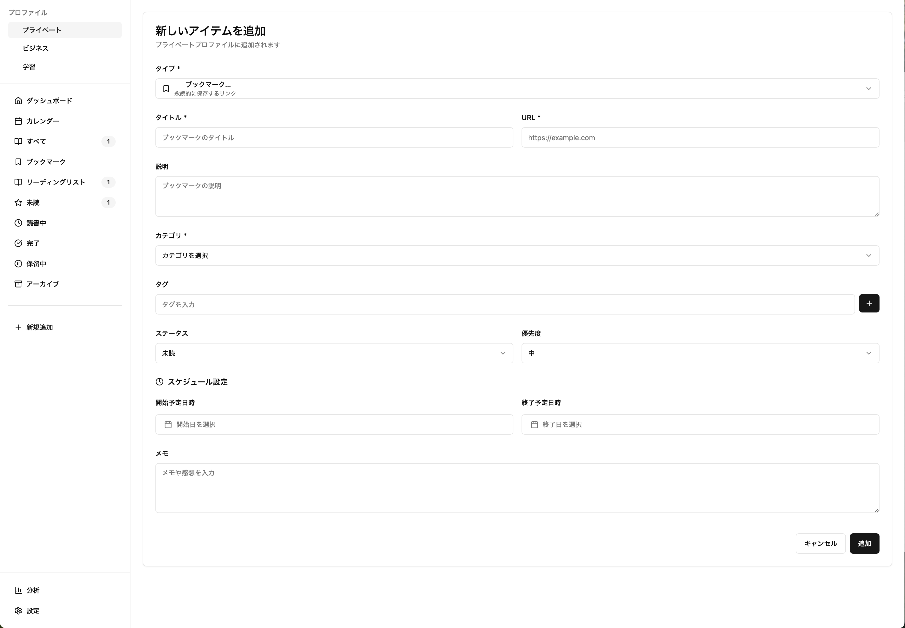
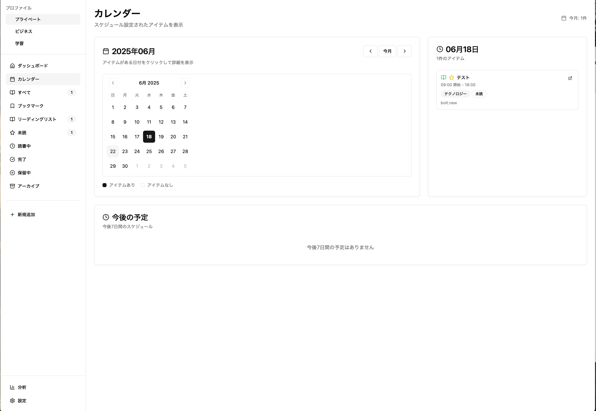

# Bolt.new

https://bolt.new/

## 目的

- Bolt.newの技術検証
- 開発したいプロダクトのコア機能のたたき台を作らせる

## 実施内容

- (ブックマーク管理 + リーディングリスト) ✕ ToDoのプロダクトを作る

## 所感

- 画面のたたき台やプロトタイプを短期間で作る、アイデア勝負の小さいプロダクトの開発に便利そう
- エクスポート機能がありがたい
  - ローカル環境でも手軽にカスタマイズできる
- 無料のデイリートークンの上限に達するのが体感早い
- プロンプトに無い機能や指示を開発プランに組み込んでくる
  - ややお節介に感じる（プロンプトが不足していただけかも）
  - 観点が不足してしまう初期段階の使用ではありがたみがあるかも

## 疑問

- UI生成の得意・不得意は？デザインの偏りは？限界点

## 参考リンク

[今さらながら Bolt.new について徹底的に調べてみた](https://qiita.com/syukan3/items/c8000073ffed31a9c0e8)

## 動作確認

``` bash
npm install
npm run dev
```

## 記録

### 成果物

1. ダッシュボード
  
1. 登録画面
  
1. カレンダー
  

### プロンプト

No1

``` txt
Next.js、NestJSでブックマークやリーディングリストを管理するアプリを作りたいです。
また、それぞれにToDoアプリのようにステータスやメモ、期日（開始日、終了日）を設定したい。
カテゴリごとにプロファイル（プライベート、ビジネスのように）を切り替えれるようにしたい。
```

No2

``` txt
新追加する際にドロップダウンでブックマークかリーディングリストか選択できるようにしたいです。
ブックマークは永続的に保存するもので、リーディングリストは一時的に保存するもので、読んだらアーカイブや削除することが多いと思います。
```

No3

``` txt
サイドメニューにカレンダーを追加したい
開始予定日時が設定されたアイテムを表示したい
```

No4（未着手）

``` txt
ツリー構造でアイテムを管理したいです
```

## メモ

- NextJSなどのバックエンドのフレームワークやデータベース製品は選択できない
- Netlifyへデプロイできる
- Bolt.newで生成したコードはバックエンドデータベースとしてSuppabase（その他認証機能もある）と連携可能
- Webセッションが切れて停止するため、実施中はPCをスリープしたり、他のタブに切り替えられない
