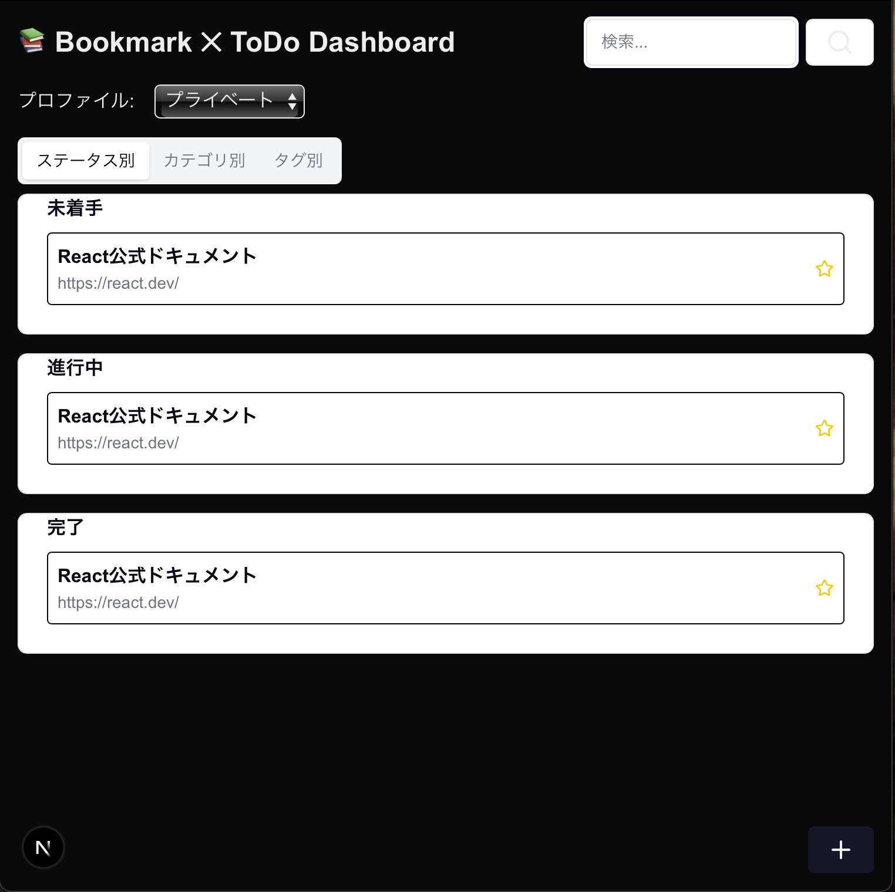

# ChatGPT Canvas

モデル：GPT-4o
プラン：無料

## 目的

- ChatGPT Canvasの技術検証
- 開発したいプロダクトのコア機能のたたき台を作らせる

## 実施内容

- (ブックマーク管理 + リーディングリスト) ✕ ToDoのプロダクトを作る

## 所感

- 1ファイル単位の生成・更新のため、フォルダ構造や依存関係の複雑なアプリ設計には向かない
- プロンプトに対し、機能が足りない
- UIが好みではない
- tsxファイルを1ファイルのみの生成のため、ローカル環境で実行する場合は別途準備が必要

## 疑問

## リンク集

## 動作確認

``` bash
npm install
npm run dev
```

## 記録

### 成果物

  

### プロンプト

``` txt
Next.jsとNestJSで「(ブックマーク管理 + リーディングリスト) ✕ ToDo」のWebアプリを開発したいです。
ブックマーク管理やリーディングリストのアイテムをToDoアプリのように以下を設定したいです。 

- メモ
- カテゴリ（カスタマイズ可能）
- タグ（カスタマイズ可能） 
- スケジュール（開始日時、終了日時）、リマインド 
- ステータス（未定、未着手、進行中、保留、完了、アーカイブ、削除） 
- 優先度（高、中、低）

また、アイテムを以下の機能で管理したい
- プロファイル（プライベート、ビジネス、学習など任意に追加可能）
  - 「全て」からすべてのプロファイルのアイテムを表示可能
  - ドロップダウンで切り替え
- ダッシュボード
- グループ管理（ステータス/カテゴリ/タグごとにグループ分け）
- ツリー構造（フォルダとアイテム）
  - アイテムをタップすると閲覧モードでアイテムの内容をモーダルウィンドウで表示
    - 右上の「✕」でモーダルウィンドウを閉じる
- カレンダー
- アーカイブ
- ゴミ箱
- お気に入り

その他の要件
- ドラッグ&ドロップでアイテムを並び替え
- 検索&フィルタリング機能
- レスポンシブデザイン（スマホ、タブレット、PC）

ソースコードを生成して、併せてイメージも表示してください。
```

### コマンド

``` bash
npx create-next-app@latest my-bookmark-app --typescript --app
cd my-bookmark-app
npm install tailwindcss postcss autoprefixer lucide-react @radix-ui/react-tabs
npx tailwindcss init -p
```
