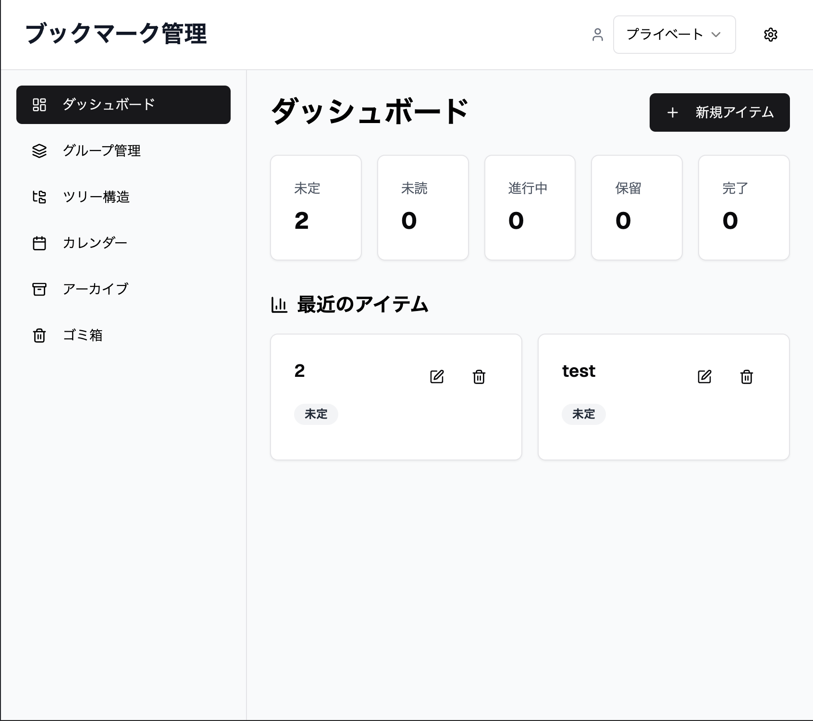
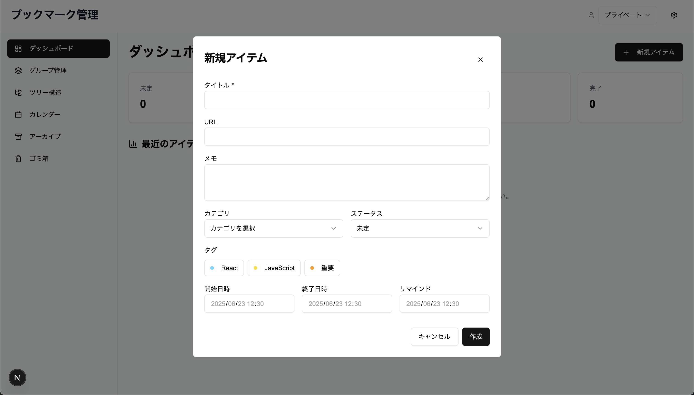
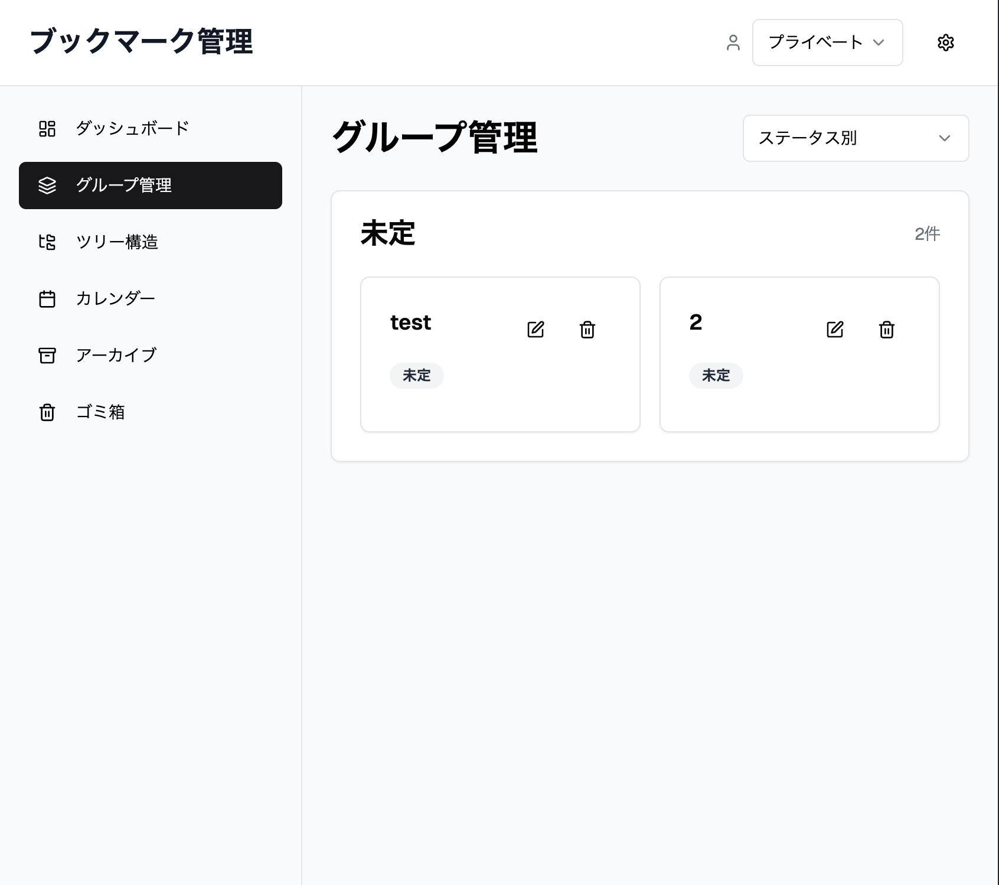
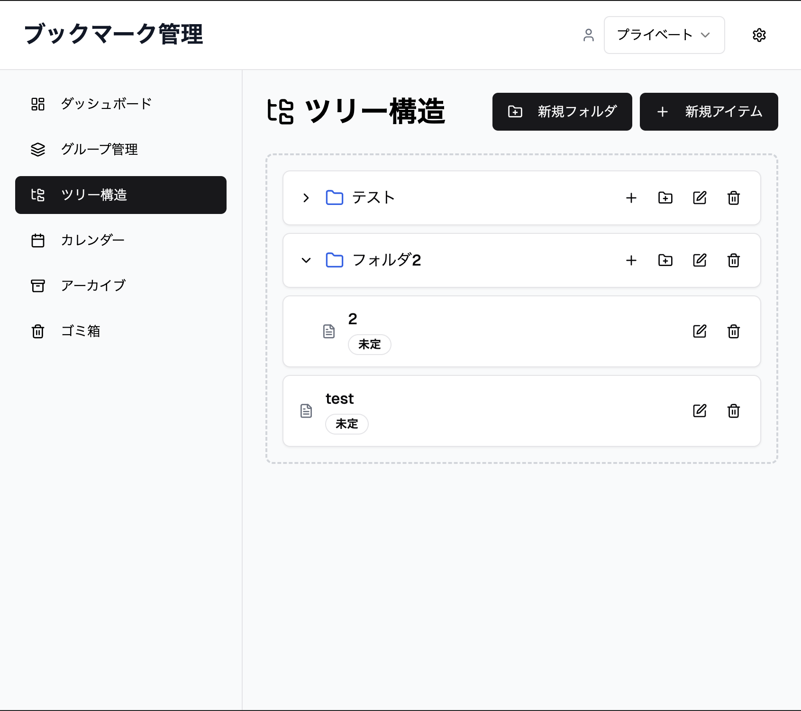
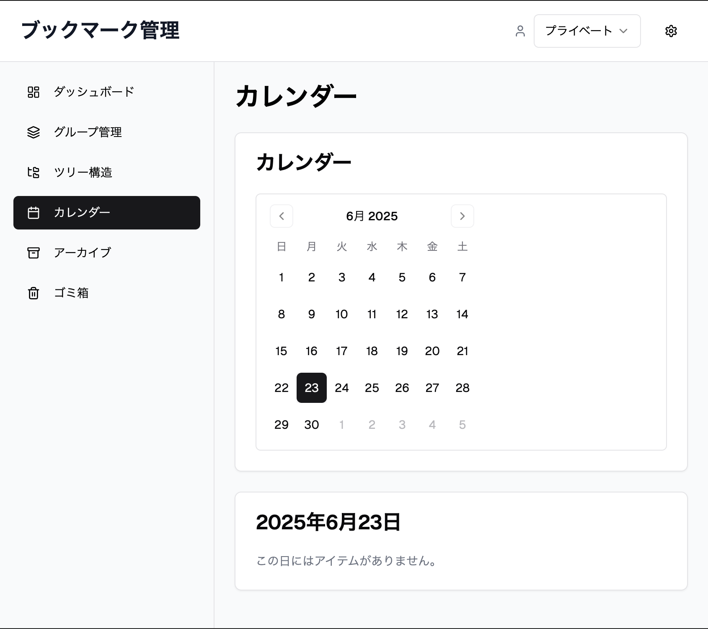

# Vercel v0

https://v0.dev/

## 目的

- Vercel v0の技術検証
- 開発したいプロダクトのコア機能のたたき台を作らせる

## 実施内容

- (ブックマーク管理 + リーディングリスト) ✕ ToDoのプロダクトを作る

## 所感

- 指示通りの機能をデザイン化してくれる
- ソースコードのダウンロードができるのもありがたい

## 疑問

## リンク集

## 動作確認

``` bash
pnpm install --ignore-workspace
pnpm dev
```

## 記録

### 成果物

1. ダッシュボード
  
1. 登録画面
  
1. グループ管理
  
1. ツリー構造
  
1. カレンダー
  

### プロンプト

No1

``` txt
ブックマーク管理やリーディングリストのアイテムをToDoアプリのように以下を設定したい
・メモ
・カテゴリ（カスタマイズ可能）
・タグ（カスタマイズ可能）
・スケジュール（開始日時、終了日時）、リマインド
・ステータス（未定、未読、進行中、保留、完了、アーカイブ、削除）

また、アイテムを以下の機能で管理したい
・プロファイル（プライベート、ビジネス、学習）、ドロップダウンで切り替え
・ダッシュボード
・グループ管理（ステータス/カテゴリ/タグごとにグループ分け）
・ツリー構造
・カレンダー
・アーカイブ
・ゴミ箱
```

No2

``` txt
ツリー構造で、フォルダとアイテムを入れ子構造にしたい
また、アイテムをドラッグ＆ドロップしたい
```
